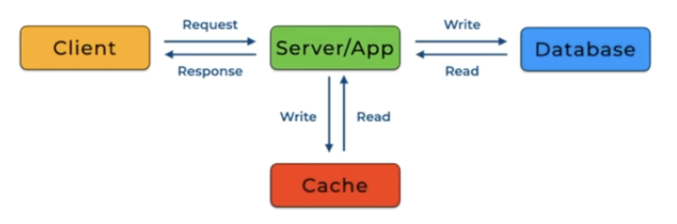

# Caching
### It is about
```
Latency reduction
Throughput increase
p99 improvement
Cost reduction
```
### At the expense of
```
Consistency complexity
Invalidation difficulty
Operational risk
```
## When do we need Caching
1. Read heavy workload
2. High p99 latency from disk/DB
3. Expensive computation
4. Network RTT dominates latency
5. Hot keys exists

## 1. Cache Aside (Lazy Loading)
### What is it
- Applications manages cache manually
- Read Flow
    1. Check cache
    2. If miss -> read DB
    3. Store in cache
    4. Return result
- Write Flow
    1. Write to DB
    2. Invalidate Cache
- 

### Pros
- Simple and Easy to implement
- Cache only hot data
- DB is the single source of truth
- Works if cache goes down

### Cons
- Cache miss penalty
- TTL and app code to keep DB and cache consistent
- Thundering herd problem
- Invalidation complexity

### When to use
1. Read heavy systems
2. Moderate consistency requirements
3. Product cataloge, user profiles, feed reads

### Tip
Mention
1. TTL
2. Invalidation strategy
3. Locking to prevent stampede


# Read Through Cache
### What it is
- Cache layer automatically fetches from DB on miss
- Application only talks to cache
- Flow
    1. App -> Cache
    2. Cache miss -> Cache fetches DB
    3. Cache stores result
    4. Cache return data to app
- 
### Pros
- Centralized caching logic
- Easier to standardized
- Great alternative for read heavy workflows

### Cons
- Cache tightly coupled to DB
- Cache failure leads to system failure
- data modelling of cache has to be similar to DB
- Cache layer instroduced extra layer of latency for writing data to DB(solved using write around pattern)

### When to use
1. Large infra teams
2. Shared cache services
3. Enterprises platforms

#### Read-through centralizes cache logic but reduces application-level control

# Write-Through Cache
### What it is
- Write goes to 
    - App -> Cache -> DB
- cache immediately updates on write

### Pros
1. Cache is always consistent
2. Simplifies Read Logic

### Cons:
1. higher Write latency
2. Writes amplified

### When to Use
1. Strong consistency required
2. Session stores
3. User settings

#### Write-through reduces staleness but increases write latency
### Note: Read through and Write through are generally used together

# Write Around Cache
### What is it
- Writes bypass cache (App → DB)
- Cache updated only on read
- This avoids polluting cache with data that won’t be read soon

### Pros
1. Better cache efficiency
2. Less memory pressure

### Cons
1. First read after write is slow
2. Slight staleness risk

### When to Use
1. Write-heavy systems
2. Logging
3. Analytics ingestion

# Write Back (Write-Behind) Cache
- Writes go from `app to cache`
- Cache writes to DB asynchronously

### Pros
- Very low write latency
- High throughput
- Good for batching

### Cons
- Data loss risk
- Cache crash loses data
- Complex durability guarantees

### When to Use
- Analytics
- Logging
- Non-critical systems
- Event buffering

### Not for
- Payments
- Banking
- Strong consistency systems

#### Write-back increases throughput but risks data loss, so only suitable for non-critical systems.

# Cache Invalidation
### Why it matters
- Stale data leads to wrong behaviour
- One of the two hard problem in CS

### Strategies
#### 1. TTL (time to live)
- Simple, but may serve stale data
#### 2. Write Invalidate
- Delete cache on update
- Race condition (cache corruption)
```
1. Thread A reads old value from cache
2. Thread B updates DB + deletes cache
3. Thread A writes stale value back to cache
```
#### 3. Write Update
- Update cache immediately
#### 4. Versioning
- Use version numbers in keys
- Eventual consistensy and mature solution in distributed systems

### Problems
#### 1. Thundering herd 
- Cache expires
- Thousands of requests hit DB simultaneously
- Solution: Randomized TTL, Mutex lock per key
#### 2. Cache stampede
- Multiple threads try to rebuild cache simultaneously.
- Solution: Single flight pattern, lock per key, request coaleascing
#### 3. Race conditions
- Solution: Compare version before write, use atomic operations
#### 4. Eventual consistency delays
- Solution: Use centralized cache, use consistent hashing

# CDN (Content Delivery Network)
### What it is
- Edge cache distributed globally.
- Caches:
    - images
    - videos
    - static assets
    - API responses

### When to Use
- Media heavy apps
- Global users
- Static content

### Tradeoffs
- Hard invalidation
- Stale content risk
- Cache propagation delay

#### use CDN for static assets and large media to reduce origin server load and global latency