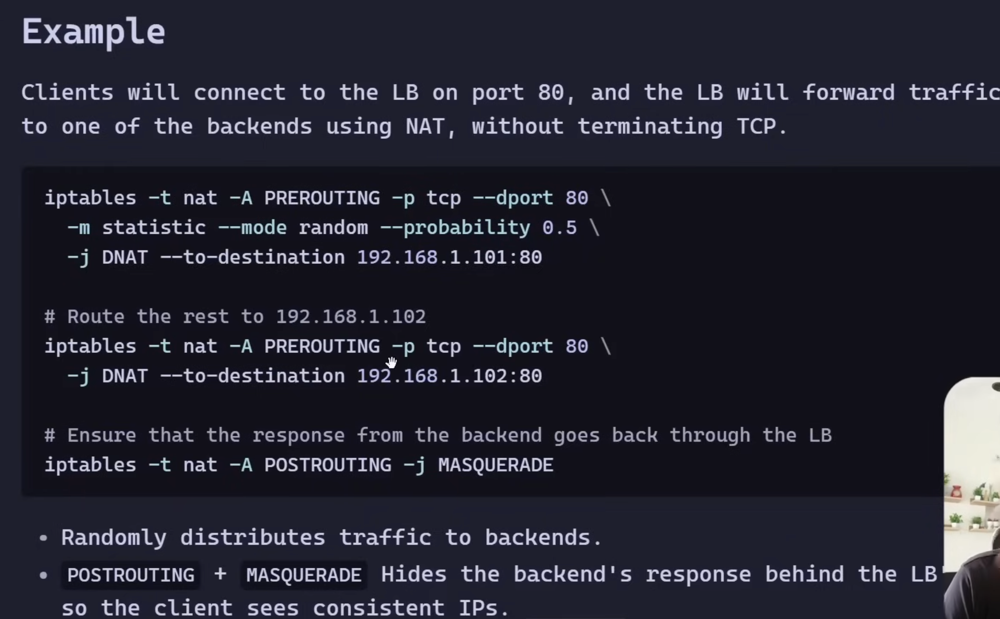
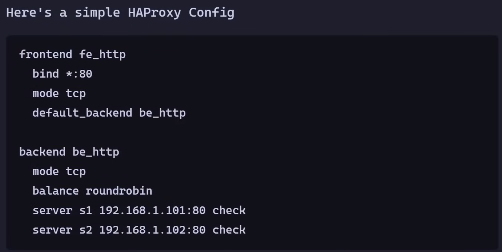

# 1. Load Balancers
1. Removes bottlenecks
2. Isolate failures
3. improving tail latency
4. enabling horizontal scaling
5. reducing blast radius
6. Provides reliability, scalability and availability
- It solves 
```
How do we distribute traffic efficiently, reliably, and predictably across multiple instances?
```

## LB in Architecture
` Client -> DNS -> LB -> Server -> DB`
- LB is often
    - first point of entry
    - failure boundary
    - scaling control plane

## L4 LB (Transport Layer)
- Operates at TCP/UDP layer
- It see
    1. IP address
    2. Ports
    3. Protocols

### Examples
1. AWS NLB
2. HAProxy (TCP mode)
3. Linux iptables

### Routes traffic based on 5-tuple:
```
source IP
source port
destination IP
destination port
protocol
```

### 2 modes
#### 1. Pass-Through mode
- LB forwards pkts using NAT
- Doesnot inspect application data
- Only 1 connection (Client -> Backend)
- LB doesnot terminate the connection
- Routing
    1. Random
    2. Hash Based
    3. Source IP hash
```
1. Client opens a TCP connection to LB
2. LB rewrites the pkt to backend servers s1 or s2 using NAT
3. Backend servers responds, client still thinks LB is responding
4. Only 1 connection(client-backend) exits. But LB transparantely forwards pkt in both directions

```


#### 2. Proxy Mode
- LB terminates the connection
- Starts a new TCP connection to backend
- Two TCP connections exits `Client <-> LB <-> Backend`
- Client and backend donot talk directly
- Since LB handles each connections, LB can implement more intelligent routing using live metrics like:
    1. Current connection count per server
    2. Latency
    3. Health status
- Intelligent(advanced) routing
    1. Round Robbin
    2. Least Connection
    3. Weighted Round Robin
    4. IP hash, Random
- Examples: HAProxy, Envoy, NGINX Streams
- Allows for 
    1. Rate limiting, retries, etc at TCP level
    2. Connection level observability (TCP errors, RTT, drops)



### Pros
- Very fast
- Low overhead
- Scales well
- Good for high throughput systems
- Works for any TCP/UDP protocol

### Cons
- No application awareness
- Cannot route based on URL/path
- No header-based routing
- No smart request inspection

### When to Use
- High-performance systems
- gRPC
- Database traffic
- Gaming
- Internal services

### L4 is ideal when
Routing logic is simple and performance matters more than flexibility

## L7 LB (Application Layer)
- Operates at `HTTP / HTTPS`
- Understands
    1. Headers
    2. Cookies
    3. URLs
    4. Hostnames
- Can make routing decisions by inspecting content

### Examples
1. NGINX
2. Envoy
3. AWS ALB
4. HA Proxy (HTTP mode)

### Pros
- Path-based routing
- Host-based routing
- A/B testing
- Canary deployments
- Rate limiting
- TLS termination
- Authentication

### Cons
- More CPU overhead
- Slightly high latency
- More complex

### When to Use
- Microservices
- API gateways
- Multi-service routing
- Canary deployments

### L7 is idea for
Modern product companies at edge because flexibility > micro-optimization

# 2. Reverse Proxy

## Proxy
- Machine or set of machines that sit between 2 systems (2 services or 1 client & 1 service) to abstract out complexities

## Forward proxy
- Abstracts the client by acting as a middleman for services
- Services feel they are talking with proxy and have no idea about users

### Provides
1. Security: protects client identity(server see proxy's ip)
2. Policies: restrict access to certain services or tool
3. Caching: access certain content faster and offline

## Reverse Proxy
- Abstracts the complexity of downstream systems for clients
- Users are talking to proxy, and have no idea about number/type of servers

### Use Cases
1. Load Balancers: It balances load by distributing work among servers, user feel there is only 1 server(reverse proxy)
2. Routing(API Gateways): Incoming request to appropriate server
3. Caching: static response content
4. Abstraction of infra elasticity(autoscaling)
5. DB Proxy: abstracts db topology(sharded, partitioned) so user can easily qeury it. Also cache responses, pool connections to database
6. Rate limiting
7. Logging
8. Websocket handling
9. Compression & Authentication
10. SSL termination

### Examples
1. NGINX
2. HAProxy
3. Kong gateway
4. ProxySQL

# 3. Sticky Sessions
Ensures a client is routed to the same backend server across requests.

### Used when:
- server holds session state
- WebSockets
- in-memory session store

### Why It’s Dangerous
Sticky sessions reduce flexibility:
- Load imbalance possible
- Harder scaling
- Harder failover
- Harder rolling deploy

### Why It Exists

Because some systems are stateful.
Example:
- Chat server holding connection state
- Multiplayer game server

### Decision Logic
1. Stateless service → no sticky sessions
2. Stateful but scalable → externalize state (store state in cache/redis)
3. Stateful + unavoidable → use sticky + shard carefully

#### Health checks and least-connections routing will help reduce tail latency

# 4. Consistent Hashing
- It is critical for scalable load distribution
### What it solves
- When servers scale up/down, Normal hashing causes massive key movement.
- Consistent hashing minimizes reshuffling.
### Idea
- Instead of `hash(key)%N`
- Use a hash ring.
- When node added/removed, only small subset of keys move
- When a server joins or leaves, only keys in its immediate neighborhood are affected.

### Used in:
- Distributed caches (Redis cluster)
- Sharded databases
- Distributed key-value stores
- CDN edge nodes

### Without Consistent Hashing
- Adding 1 node to 10-node cluster: nearly all keys reshuffled
- With consistent hashing: only ~1/N keys move

### Limitations
1. Uneven Load Distribution 
- If node positions on the ring are not uniform, some servers handle more keys than others → can be solved using virtual nodes
2. Hotspots 
- Certain data_keys may be accessed more frequently, causing overload on specific servers -> replicate hot keys, dedicated shards, split logical key