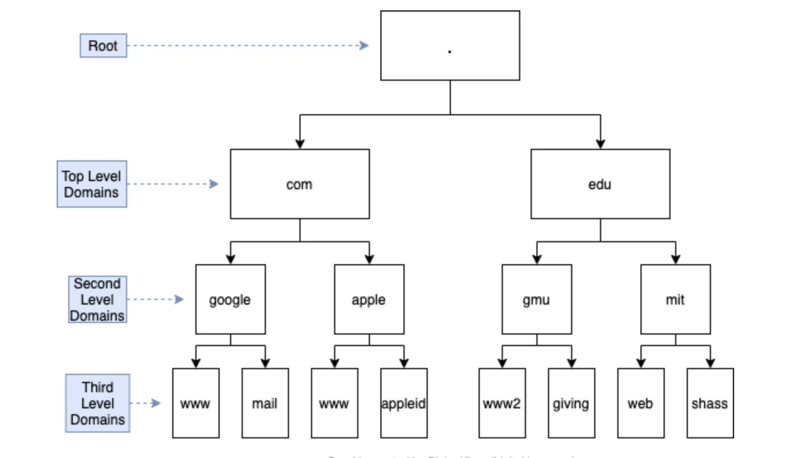
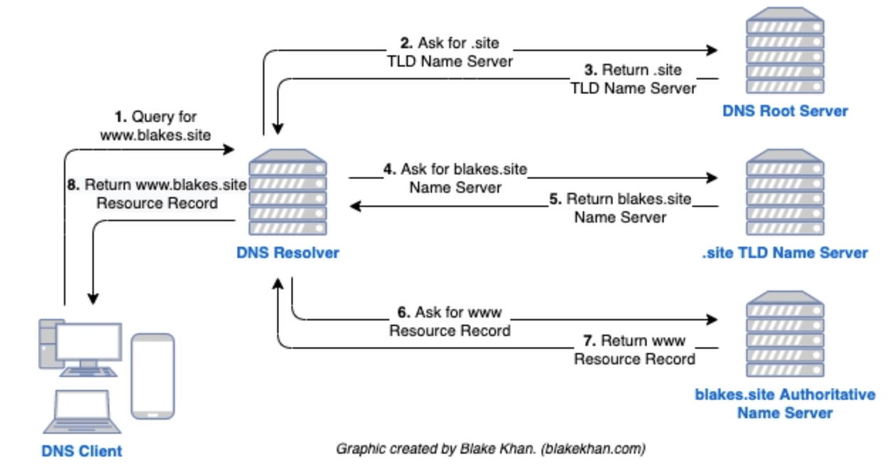
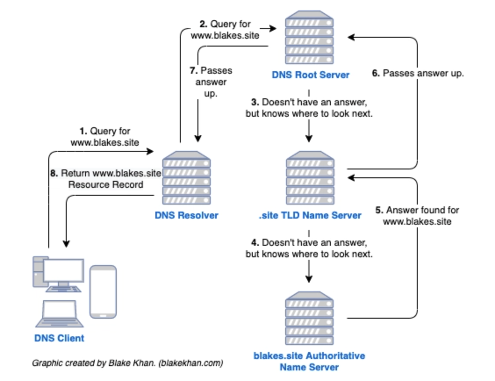
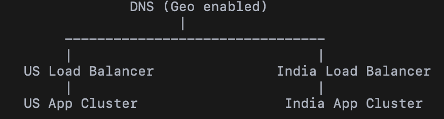
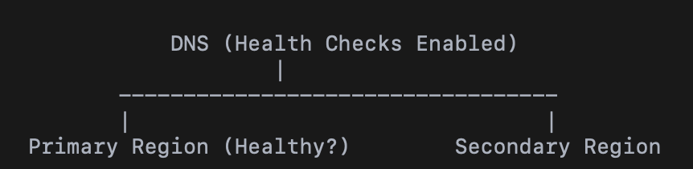
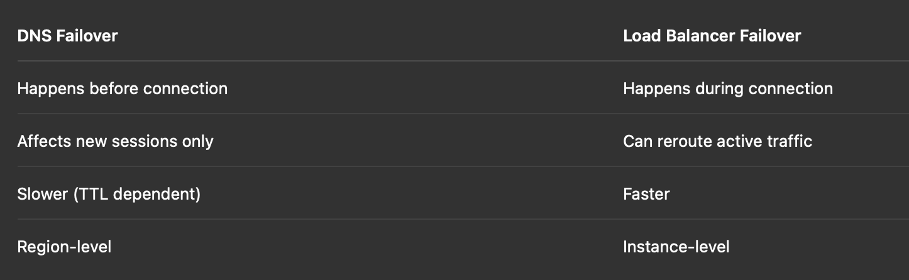
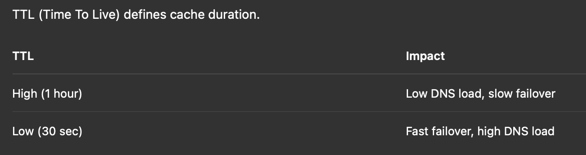
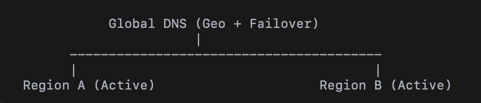

# DNS (Domain Name Service)
- DNS is not just domain-IP mapping, but
    - A globally distributed control plane
    - A hierarchical trust system
    - A highly cached, eventually consistent infrastructure
    - A policy + governance ecosystem (RRR model)
    - UDP-first, TCP fallback

## Why Not Use IP Directly?
Because:
- Humans cannot memorize IPs (especially IPv6)
- IPs change due to:
- Autoscaling
- Region failover
- CDN routing
- Infrastructure migrations

Domain names provide:
- Stability
- Abstraction
- Flexibility
- Traffic steering capability

In modern infra, DNS is not just mapping — it’s traffic control.

## DNS is created to be:
- Distributed
- Hierarchical
- Delegated
- Scalable

## DNS is used for
- Global load balancing
- Multi-region routing
- Blue/green deployments
- Canary releases
- Disaster recovery
- Traffic steering
- Latency optimization

DNS becomes a traffic control plane.

## DNS is hierarchical
- Hierarchy flows from bottom to up



### Root Zone Servers
There are 13 logical root server clusters:
- a.root-servers.net
- b.root-servers.net
- …
- m.root-servers.net

They are operated under coordination of ICANN.

These are:
- Anycasted
- Globally distributed
- Hardcoded into resolvers

They do NOT know IPs of all domains.
They only know `Which nameservers handle which TLD`

## DNS is Decentralized

Each layer delegates responsibility downward.
| Layer      | Responsible For        |
| ---------- | ---------------------- |
| Root       | TLD servers            |
| TLD        | Second-level domain NS |
|Domain owner| Authoritative records  |

Example:
- .com registry doesn’t manage netflix.com’s IP
- Netflix manages its authoritative nameservers

This enables:
- Scalability
- Independent scaling
- Operational separation

## The RRR Model (Governance Layer)

### 1. Registrant
- The domain owner.
- Example: If Alice buys alice.rocks, she is the registrant.

### 2. Registrar
- Sells domain registrations.
- Examples:
    - GoDaddy
    - Namecheap
- They interface with registries.

### 3. Registry
- Operates TLD backend infrastructure.
- Examples:
    - .com → Verisign
    - .org → Public Interest Registry
- Each TLD(Top level domain) has exactly one registry

## DNS Resolution — The Core Mechanism

Resolution = “Where is this FQDN(Fully Qualified Domain Name)?”

There are 5 actors:
1. Client (browser)
2. Recursive Resolver (ISP / public DNS)
3. Root Server
4. TLD Nameserver
5. Authoritative Nameserver

### Flow
1.	Client → OS Stub Resolver
2.	Stub → Recursive Resolver (ISP / 8.8.8.8 / 1.1.1.1)
3.	Recursive → Root Server
4.	Root → TLD (.com)
5.	TLD → Authoritative DNS
6.	Authoritative → Final IP


### Iterative Resolution
In iterative:
- Resolver asks root server
- Root server gives TLD NS ipaddress
- Resolver asks TLD
- TLD gives authoritative NS ipaddress
- Resolver asks authoritative NS
- Gets final answer


Resolver does the work.

Most real-world resolution is this model.


### Recursive Resolution

In recursive:
- Server performs full lookup on behalf of client.
- Returns final answer directly.



Faster due to caching but:
- Vulnerable to cache poisoning
- Higher attack surface

## Caching - The Performance Backbone

DNS is highly cached at:
- Browser
- OS
- Recursive resolver
- TLD
- Authoritative servers

Because -> DNS is read-heavy (millions QPS globally)

### TTL (Time To Live) defines cache duration.
1. Low TTL:
    - Faster failover
    - Higher load

2. High TTL:
    - Lower load
    - Slower changes

## Things to Note
1. DNS is Eventually Consistent
- Propagation is not instant.
- Changing DNS record does NOT instantly shift traffic.


2. DNS is a Control Plane
- It decides where traffic should go.
- Actual traffic routing happens in:
    - Load balancers
    - CDNs
    - Reverse proxies

3. Root Servers Rarely Hit
- Due to heavy caching, most popular domains:
    - Never reach root
    - Often never reach TLD

- Resolvers cache aggressively.

4. Security Considerations
- Risks:
    - Cache poisoning
    - DNS amplification
    - DDoS attacks

Mitigations:
    - DNSSEC
    - Anycast
    - Rate limiting
    - Multi-provider authoritative DNS

# Geo Routing
- Geo-routing uses the client’s geographic location (derived from resolver IP) to return different IP addresses.
- Example:
```
user from India → 18.10.10.1 (Mumbai region)
user from US → 3.20.40.1 (Virginia region)
```
### How It Works Internally

When a DNS query hits the authoritative DNS:
1. DNS checks resolver IP
2. Maps IP → region (GeoIP database)
3. Returns region-specific IP

### Architecture


### Geo Routing Policy
#### 1. Latency-based routing
Return region with lowest measured latency.

#### 2. Geolocation routing
Return region based on country/continent.

#### 3. Weighted routing
Split traffic (e.g., 80% old infra, 20% new infra).


# FAILOVER IN DNS


If Region A goes down → traffic shifts to Region B automatically.

### How DNS Failover Works
DNS provider integrates:
- Health checks (HTTP / TCP / custom)
- If endpoint unhealthy → stop returning its IP
- Return backup IP instead

### Architecture


### DNS Failover vs Load Balancer Failover


## TTL


## Multi region design pattern


1. Active–Passive
- Cheaper
- Slower failover
- Good for DR

2. Active–Active
- Better latency
- Complex data replication
- Conflict resolution required