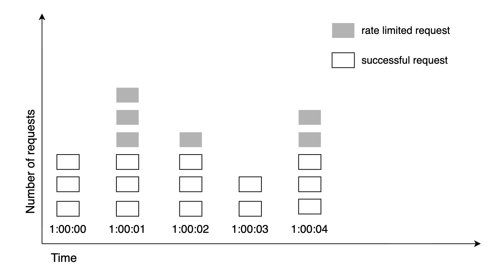
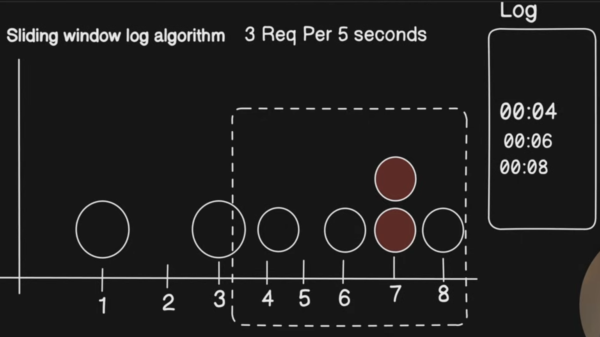
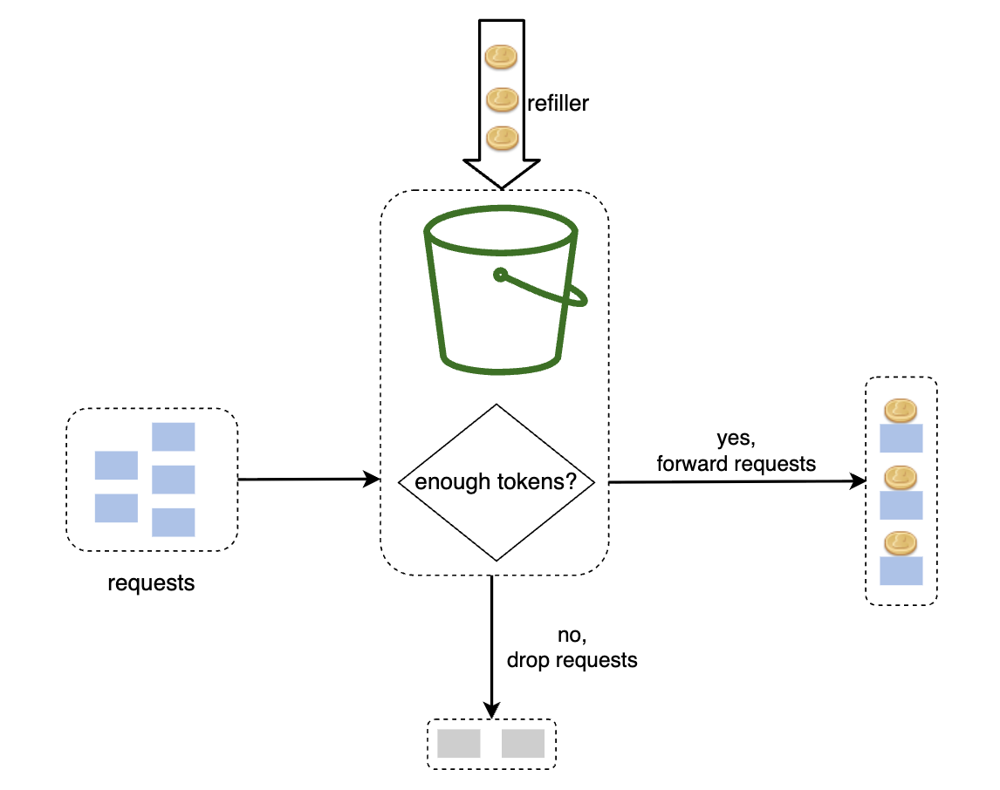
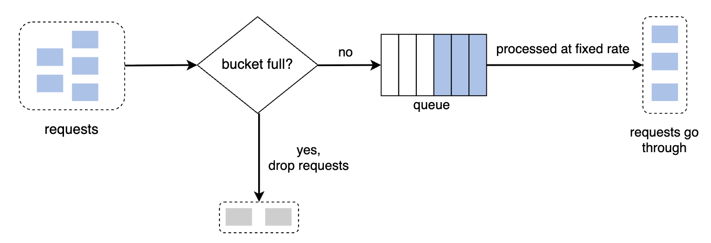

# Rate Limiting & Throttling
They are capacity protection mechanisms.

In real production systems, they protect:
- Shared infrastructure (databases, caches, message brokers)
- Expensive dependencies (3rd-party APIs, ML models, payment gateways)
- Multi-tenant fairness
- Cost boundaries (cloud egress, LLM tokens, compute)
- SLA guarantees for premium tiers
- Control plane stability

If you remove rate limiting in a high-scale product, you don’t get “more throughput.”
You get cascading failure.

## Rate limiting
Hard enforcement of request quotas within a defined time window.
- Client exceeds quota → request is rejected (typically HTTP 429).
- Deterministic boundary.
- Example: 1000 requests per minute per user.

Stricy policy enforcement -> static contract

## Throttling
Dynamic slowdown or shaping of traffic to protect system health.
- Can delay, queue, or degrade.
- Can be adaptive (based on CPU, latency, queue depth).
- May not strictly reject.

Capacity protection under load -> dynamic resilience mechanism

### 1. Edge Layer (Most Common)
Examples:
- Cloudflare
- Amazon Web Services API Gateway

Placed:
- Closer to user
- Before hitting our infra
- Cheap to enforce
- Protects backend early

Best for:
- Public APIs
- DDoS protection
- Bot mitigation

### 2. API Gateway Layer
Examples:
- NGINX
- Envoy Proxy

Enforces:
- Per API key
- Per consumer tier
- Per endpoint

### 3. Service-Level Rate Limiting
Used internally for:
- Protecting DB
- Protecting ML inference service
- Protecting payment service

Often implemented with:
- Redis
- In-memory counters
- Distributed coordination


### 4. Client-Side Throttling
Especially important in:
- Mobile apps
- SDKs
- High-frequency services

Example:
- SDK backs off exponentially when receiving 429.


## Guidelines to decide
1. Evaluate your current technology stack, such as programming language, cache service, etc. Make sure your current programming language is efficient to implement rate limiting on the server-side.

2. Identify the rate limiting algorithm that fits your business needs. When you implement everything on the server-side, you have full control of the algorithm. However, your choice might be limited if you use a third-party gateway.

3. If you have already used microservice architecture and included an API gateway in the design to perform authentication, IP whitelisting, etc., you may add a rate limiter to the API gateway.

4. Building your own rate limiting service takes time. If you do not have enough engineering resources to implement a rate limiter, a commercial API gateway is a better option.

# Algorithms
## 1. Fixed Window Counter Algo
### How it works
- Divides the timeline into fix-sized time windows and assign a counter for each window. 

- Each request increments the counter by one.

- Once the counter reaches the pre-defined threshold, new requests are dropped until a new time window starts.



### Pros
- Simple
- Cheap
- Memory efficient

### Cons
- Boundary burst problem:
- 100 requests at 12:00:59
- 100 more at 12:01:00
- Effectively 200 requests in 1 second

### When used
- Internal tools
- Low precision needs

#### Not ideal for public APIs at scale

## 2. Sliding Window Log Algo
### How it works
- Keeps track of request timestamps. Timestamp data is usually kept in cache, such as sorted sets of Redis.

- When a new request comes in, remove all the outdated timestamps which are older than the start of the current time window.

- Add timestamp of the new request to the log.

- If the log size is the same or lower than the allowed count, a request is accepted. Otherwise, it is rejected.


### Pros
- Precise
- No burst boundary issue

### Cons
- High memory

#### Used rarely at massive scale unless optimized via sorted sets (e.g., Redis ZSET).

## 3. Sliding Window Counter Algo (Prod fav)
### How it work
- We have fixed windows like fixed window counter algo, and a rolling sliding window is used to ensure rate limiting
- the number of requests in the rolling window is calculated using the following formula:
```
Requests in current window + requests in the previous window * overlap percentage of the rolling window and previous window
```

### Pros
1. It smooths out spikes in traffic because the rate is based on the average rate of the previous window.
2. Memory efficient.

### Cons

- It only works for not-so-strict look back window. It is an approximation of the actual rate because it assumes requests in the previous window are evenly distributed. However, this problem may not be as bad as it seems. According to experiments done by Cloudflare [10], only 0.003% of requests are wrongly allowed or rate limited among 400 million requests.

#### Used in API gateways and edge rate limiters

## 4. Token Bucket Algo (Industry fav)
### How it works
- Bucket holds N tokens.
- Tokens refill at fixed rate.
- Each request consumes 1 token.
- If empty → reject.


### Pros:
1. The algorithm is easy to implement.
2. Memory efficient.
3. Token bucket allows a burst of traffic for short periods. A request can go through as long as there are tokens left.

### Cons:
1. Two parameters in the algorithm are `bucket size` and `token refill rate`. However, it might be challenging to tune them properly.

#### Used by Amazon and Stripe to throttle their APIs

## 5. Leaky Bucket Algo
- similar to the token bucket except that requests are processed at a fixed rate
- Implemented using a FIFO queue

### How it works
- When a request arrives, the system checks if the bucket/queue is full. If it is not full, the request is added to the queue.
- Otherwise, the request is dropped.
- Requests are pulled from the queue and processed at regular intervals.
- Queue and bucket are of same size



### Pros:
1. Memory efficient given the limited queue size.

2. Requests are processed at a fixed rate therefore it is suitable for use cases that a stable outflow rate is needed.

### Cons:
1. A burst of traffic fills up the queue with old requests, and if they are not processed in time, recent requests will be rate limited.

2. There are two parameters in the algorithm `queue/bucket size` and `outflow rate`. It might not be easy to tune them properly.

# Distributed Rate Limiting