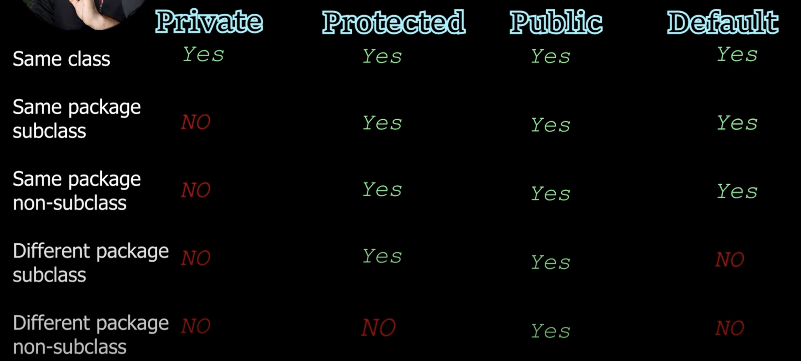
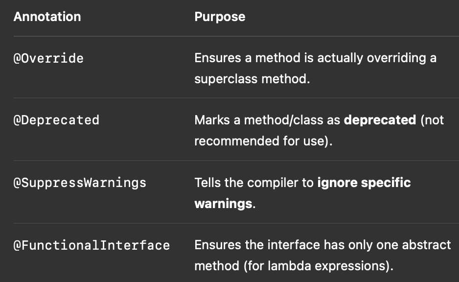
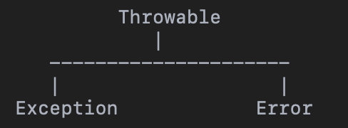
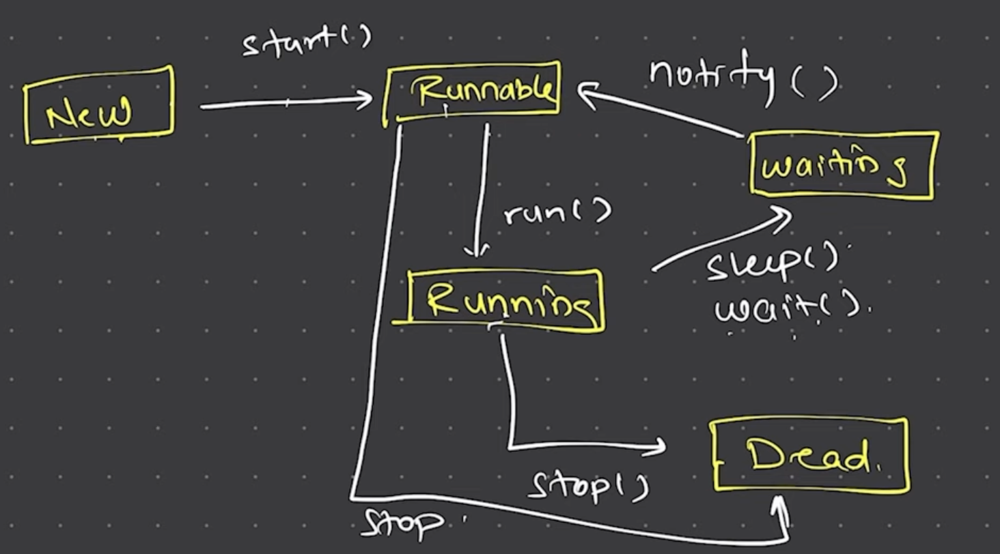

## Installation
- Download LTS version from official oracle java website
- MacOS silicon chip => install arm64 dmg
- Check the installation


## Check if java and java compiler are installed
- java --version
- javac --version


## Install Extension
- Extension Pack for java by Microsoft


## Jshell
1. Introduction
- Type and execute Java code snippets interactively.
- No need to write a full class or method.

2. Usage
- Initiates a Jshell 
jshell     
- Exit the Jshell
exit


## How Java Works
- It is platform independent because of JVM 
- But JVM is not platform independent 
- JVM accepts byte code as an input
- Java Compiler converts the code into byte code and send to JVM
- JVM + external libraries is a part of JRE(Java runtime environment)
- Java is WORA (Write Once Read Anywhere)
- We need only JRE(JVM+libraries) to run the same code on different machines and JDK is not required 


## How do we run a Java code?
1. Compile the code file (output is byte code => file_name.class)
javac file_name.java
2. Use JVM to run the class
java class_name


## Data Types (Primitive Data Type)

1. Integer
    1. Byte => 1 byte => -2^7 to 2^7 - 1 => -128 to 127
    2. Short => 2 bytes => -2^15 to 2^15 - 1 
    3. Int => 4 bytes (default)
    4. Long => 8 bytes
2. Float
    1. Double => 8 bytes (default)
    2. Float = 4 bytes 
3. Character
    1. Char => 2 bytes (UNICODE and not ASCII)
4. Boolean 
    1. boolean => only True and False (no 0/1)

```java
byte by = 127;
short st = 556;
int ig = 1023;
long lg = 1293l;  //default is int

float fg = 0.7f;  //default is double
double dd = 0.122;

char c = 'k'

boolean flag = true;
```

## Class and Objects (also a Non-Primitive Data Type)
```java
class Student{
    public int hello_world(){
        System.out.println("Hello from Student");
        return 10;
    }
}

class HelloWorld{
    public static void main(String a[]){
        System.out.println("Hello from Main");
        Student std1 = new Student();
        int val = std1.hellow_world();
        System.out.println(val);
    }
}
```


## Arrays (also a Non-Primitive Data Type)
```java
//array declaration intialization with custom values
int num[] = {1,2,3,4};

//array declaration intialization with all values as 0
int num[] = new int[4];
```

## Multi-Dimentional Arrays
```java
int num[][] = {{1,2,3,4}, {2,3,4,5}, {3,4,5,6}};

int num[][] = new int[3][4];
```

## Jagged Arrays
```java
int num[][] = new int[3][];

int num[0] = new int[3];
int num[1] = new int[5];
int num[2] = new int[2];

for(int i=0; i<num.length; i++){
    for(int j=0; j<num[i].length; j++){
        System.out.println(num[i][j]);
    }
}

for(int x[] : num[][]){
    for(y : x){
        System.out.println(y);
    }
}
```

## Array of Objects
```java
Student arr[] = new Student[3];
Student[0] = s1;
Student[1] = s2;
Student[2] = s3;
```

## Strings (also a Non-Primitive Data Type)
```java
String s = new String("Tanay");

String s = "tanay";

System.out.println("Hello " + s);
System.out.println(s.hashCode());
System.out.println(s.charAt(1));
```


## Immutable Strings (String Buffer & String Builder)
- String buffer => thread safe
- String builder => not thread saf

```java
StringBuffer sb = new StringBuffer("tanay");

System.out.println(sb.capacity());
System.out.println(sb.length());

sb.append(" gada");
sb.insert(0, "hi");
sb.setLenght(10);
String s = sb.toString();
```


## Static Variables
- To make a variable common to all objects, we make that variable as static
- All objects of that class share a common variable if it is declared static and hence changes done by any object reflects in other objects 
- Static variables are called using the className and not by the object

```java
class Mobile{
    String brand;
    int price;
    static String type;

    public void display_details(){
        System.out.println("brand: "+ brand);
        System.out.println("price: "+ price);
        System.out.println("type: " + type);
    }
}

class HelloWorld{
    public static void main(String a[]){
        Mobile m1 = new Mobile();
        m1.brand = "apple";
        m1.price = 1500;
        Mobile.type = "smartphone";
        m1.display_details();
        
        Mobile m2 = new Mobile();
        m2.brand = "samsung";
        m2.price = 1200;
        Mobile.type = "smartphone";
        
        m2.display_details();
        Mobile m3 = new Mobile();
        m3.brand = "Vivo";
        m3.price = 1000;
        Mobile.type = "smartphone";
        m3.display_details();
    }
}
```

## Static Methods
- To access a static variable, we need to create objects of the class
- To access a non-static method, we too need to create objects of that class
- But, to access a static method, we do not need to create objects and can directly access them using the class Name
- We can use a static variable inside a static method
- But we cannot use a non static variable inside a static method
- If we want to access the non static variables inside a static method, we can pass an object inside the static method and access them
```java
class Mobile{
    String brand;
    int price;
    static String type;

    public void display_details(){
        System.out.println("brand: "+ brand);
        System.out.println("price: "+ price);
        System.out.println("type: " + type);
    }
    
    public static void display_type(Mobile obj){

        System.out.println("Static Varible type: " + type);
        System.out.println("Non Static Varible name: " + obj.brand);

    }
}

class HelloWorld{
    public static void main(String a[]){
        Mobile m1 = new Mobile();
        m1.brand = "apple";
        m1.price = 1500;
        Mobile.type = "smartphone";

        Mobile.display_type(m1);
    }
}
```


## Static Block
- We initialize instance and static variables inside the constructor 
- Every time we create an object, static variables are initialised.
- But, static variables should be initialise only once
- We use static block, it is called only once 
```java
class Mobile{
    String brand;
    int price;
    static String type;

    static{
        type = "phone";
        System.out.println("In Static Block");
    }

    public Mobile(){
        brand = "";
        price = 0;
        System.out.println("In Constructor");
    }
}

class HelloWorld{
    public static void main(String a[]){
        Mobile m1 = new Mobile();
        Mobile m2 = new Mobile();
        Mobile m3 = new Mobile();
    }
}
```
- When we try to create the object of a class for the first time, that class is loaded into classLoader in JVM and then constructor is called to initialise the variables
- The moment class is loaded into the classLoader, static block is called 1st then objects are created and constructor is called next
- What if we are not creating an object of the class?…we hence need to explicitly land the class into the classLoader in JVM
```java
class Mobile{
    String brand;
    int price;
    static String type;

    static{
        type = "phone";
        System.out.println("In Static Block");
    }

    public Mobile(){
        brand = "";
        price = 0;
        System.out.println("In Constructor");
    }
}

class HelloWorld{
    public static void main(String a[]){
        Class.forName("Mobile");
    }
}
```


## Naming Convention
1. class and interface (CamelCase) => Calc, Runable 
2. Variable and method => marks, show()
3. Constants => PI, SIZE, BRAND


## Anonymous Objects
- Whenever we declare a non primitive data type, the memory for the data and methods is allocated in heap memory and its reference is stored in stack memory
- Anonymous objects are objects which we create but do not store their reference
- That means, they are objects for one time use.
```java
class Mobile{
    String brand;
    int price;
    static String type;

    static{
        type = "phone";
        System.out.println("In Static Block");
    }

    public Mobile(){
        brand = "";
        price = 0;
        System.out.println("In Constructor");
    }

    public void display_details(){
        System.out.println("brand: "+ brand);
        System.out.println("price: "+ price);
        System.out.println("type: " + type);
    }
}

class HelloWorld{
    public static void main(String a[]){
        new Mobile().display_details();
    }
}
```


## Inheritance 
- extends keyword is used for inheriting a parent class
```java
class Calculator{
    public int add(int x1, int x2){
        return x1+x2;
    }

    public int sub(int x1, int x2){
        return x1-x2;
    }
}

class AdvancedCalculator extends Calculator{
    public int multiply(int x1, int x2){
        return x1*x2;
    }

    public double divide(int x1, int x2){
        return (x1/(x2*1.0));
    }
}

class HelloWorld{
    public static void main(String a[]){
        Calculator c1 = new Calculator();
        System.out.println(c1.add(2,3));

        AdvancedCalculator c2 = new AdvancedCalculator();
        System.out.println(c2.multiply(2,3));
    }
}
```


## Multilevel Inheritance
```java
A
|
B
|
C
```
```java

class Calculator{
    public int add(int x1, int x2){
        return x1+x2;
    }

    public int sub(int x1, int x2){
        return x1-x2;
    }
}

class AdvancedCalculator extends Calculator{
    public int multiply(int x1, int x2){
        return x1*x2;
    }

    public double divide(int x1, int x2){
        return (x1/(x2*1.0));
    }
}

class ScientificCalculator extends AdvancedCalculator{
    public double power(int x1, int x2){
        return Math.pow(x1, x2);
    }
}

class HelloWorld{
    public static void main(String a[]){
        Calculator c1 = new Calculator();
        System.out.println(c1.add(2,3));

        AdvancedCalculator c2 = new AdvancedCalculator();
        System.out.println(c2.add(2,3));

        ScientificCalculator c3 = new ScientificCalculator();
        System.out.println(c3.multiply(2,2));
    }
}
```

## Multiple Inheritance
- Java does not supports Multiple Inheritance directly, due to ambiguity
- we use interfaces


## Super and this Methods
- Super() function allows us to call the constructor of the base class
- this() function allows us to call different constructor of the same class(eg dedault calling the parameterised and vice versa of the same class)
```java
class A{
    public A(){
        System.out.println("from A");
    }

    public A(int n){
        this();
        System.out.println("from A: " + n);
    }
}

class B extends A{
    public B(){
        // super();
        System.out.println("from B");
    }

    public B(int n){
        super(n);
        System.out.println("from B: " + n);
    }
}

class HelloWorld{
    public static void main(String a[]){
        B b1 = new B(2);
    }
}
```


## Method Overriding
- Method overriding is when a subclass provides its own implementation of a method that is already defined in its superclass.
- The method must have:
    - Same name
    - Same parameters
    - Same return type (or compatible type)
- It is done in inheritance.
```java
class A{
    public void print(){
        System.out.println("from A");
    }
}

class B extends A{
    public void print(){
        System.out.println("from B");
    }
}

class Main{
    public static void main(String[] args) {
        B obj = new B();
        obj.print();  // from B
    }
}
```


## Packages 
- Packages are like folder having similar thing together
```java
// this file is Calculator.java in tools folder
package tools;

public class Calculator{
    public int add(int x1, int x2){
        return x1+x2;
    }

    public int sub(int x1, int x2){
        return x1-x2;
    }
}

// this file is AdvancedCalculator.java in tools folder
package tools;

public class AdvancedCalculator extends Calculator{
    public int multiply(int x1, int x2){
        return x1*x2;
    }

    public double divide(int x1, int x2){
        return (x1/(x2*1.0));
    }
}

// this is the Main.java which we compile and run
import tools.Calculator;
import tools.AdvancedCalculator;

public class Main{
    public static void main(String a[]){
        Calculator c1 = new Calculator();
        System.out.println(c1.add(2,3));

        AdvancedCalculator c2 = new AdvancedCalculator();
        System.out.println(c2.add(2,3));
    }
}
```
- Dot (.) Is used to access the file structure (i.e packages)
- We use slash (/) in other languages 
- Star (*) is used to access all the files in a package
- * is used only for files and not folders inside a package


## Access Modifiers
- We have 4 access modifiers
    1. Public
    2. Private
    3. Default
    4. Protected
- Inside the same package, we can access default data and methods 
- To access data and methods which are in different packages, we need to mark them as public
- Private variables and methods can only be accessed only inside the same class 
- 
- Try to avoid using default access modifier


## Polymorphism (Many form/behaviour)
2 types
1. Compile Time Polymorphism (Early Binding)
    - Eg => overloading
2. Run Time Polymorphism (Late Binding)
    - Eg => overriding


## Dynamic Method Dispatch
- To implement run time polymorphism
- Base class reference is used to refer derived object
- Java decides at runtime which version of the method to invoke, based on the actual object type (not the reference type).
```java
class A{
    public void print(){
        System.out.println("from A");
    }
}

class B extends A{
    public void print(){
        System.out.println("from B");
    }
}

class C extends A{
    public void print(){
        System.out.println("from C");
    }
}

class HelloWorld{
    public static void main(String a[]){
        A obj = new A();
        obj.print();

        obj = new B();
        obj.print();

        obj = new C();
        obj.print();
    }
}
```


## Final keyword
- It is used to declare constants
- It can be used for variables, methods, classes

1. Final Variable
```java
javafinal double pi = 3.14;
```
2.  Final Class
- Used to stop inheritance 
- Final class cannot be inherited
```java
final class Calculator{
    ...
}
```
3. Final Method
- Used to stop method overriding
```java
final public void print(){
    ...
}
```


## Upcasting and Downcasting
class Animal {
    void speak() {
        System.out.println("Animal speaks");
    }
}

class Dog extends Animal {
    void bark() {
        System.out.println("Dog barks");
    }
}
1. Upcasting
- Converting a derived class type into a base class type
- No explicit cast needed
```java
public class Main {
    public static void main(String[] args) {
        Dog d = new Dog();
        Animal a = d; // Upcasting (automatic)
        a.speak();    // ✅ Allowed
        // a.bark();  // ❌ Not allowed (a is Animal type)
    }
}
```
2. Downcasting
- Converting a Base class type into a derived class type
- Explicit cast is needed
```java
public class Main {
    public static void main(String[] args) {
        Animal a = new Dog();  // Upcasting
        Dog d = (Dog) a;       // Downcasting (safe here because 'a' is actually a Dog)
        d.bark();              // ✅ Allowed
        
        Animal a2 = new Animal();
        // Dog d2 = (Dog) a2;  // ❌ Runtime error: ClassCastException
    }
}
```

## Wrapper Class
- Convert the primitive data type into an object 
- Allows to use primitive data types where only objects are allowed (eg. in collections like ArrayList)
```java
int num = 10;        // primitive data type   
Integer num1 = num;  // object      //auto-boxing
int num2 = num1;                    //auto-unboxing

String a = "123";
int num3 = Integer.parseInt(a);      //converts string to int
int num4 = num3*2;
```
- Primitive types cannot be null, but objects can be
```java
Integer x = null;
```


## Abstract Keyword
- It helps in hiding implementation details and show only essential features.
- Used to declare
1. Abstract Classes
2. Abstract Methods

1. Abstract Class
- An abstract class cannot be instantiated directly — it’s meant to be a base class for other classes to extend.
```java
abstract class Animal {
    abstract void sound(); // abstract method — no body

    void eat() {
        System.out.println("This animal eats food.");
    }
}
```
- We must extend it
```java
class Dog extends Animal {              // this is called concrere class
    void sound() {
        System.out.println("Barks");
    }
}
```

2. Abstract Method
- An abstract method has no body; it must be implemented in a subclass.
- If a class has at least one abstract method, the class must be declared abstract.

NOTE:
1.  We cannot create the objects of the abstract class
Animal a = new Animal(); // ❌ Error
Animal a = new Dog();

2. Subclasses must override all abstract methods unless they are also declared abstract.


## Inner Class 
- Class inside class
```java
class A{
    public void show(){
        System.out.println("from show");
    }

    class B{
        public void config(){
            System.out.println("from class B");
        }
    }
}

public class Main{
    public static void Main(){
        A obj = new A();
        obj.show();

        A.B obj1 = obj.new B();
        obj1.config();
    }
}
```
- If we make the inner class as static, we can access that class directly without need of object of A
A.B obj1 = new A.B();
- We cannot make outer class static


## Anonymous Inner Class
- Type of inner class without a name
- It is declared and instantiated all at once
- Used for implementing interfaces or to extend classes on the fly
- Used when we need to override a method or class only once
```java
class A{
    public void show(){
        System.out.println("from a");
    }
}

public class Main{
    public static void main(String s[]){
        A obj = new A(){
            public void show(){
                System.out.println("from inner annonymous function");
            }
        };
        obj.show();
    }
}
```


## Abstract and Anonymous Inner Class
- Used when we need to implement the abstract methods or interfaces only once
```java
abstract class A{
    abstract public void show();
}

public class Main{
    public static void main(String s[]){
        A obj = new A(){
            public void show(){
                System.out.println("from inner annonymous function");
            }
        };
        obj.show();
    }
}
```


## Interfaces
- Interface allows multiple inheritance (a class can implement multiple interfaces)
- Interface is preferred when we want to define a contract but not share any common code.
- If we have an abstract class having only abstract methods, we can define those abstract methods in an interface
- Every method in an interface is public abstract
```java
//Using class
abstract class A{
    public abstract void show();
    public abstract void config();
}
```
```java
// Using interface
interface A{
    void show();
    void config();
}

//Instantiate an interface in main
public class main(){
    public static void main(){
        A obj;
        obj = new A()  // we cannot instantiate an interface
    }
}
```
- Interface is a blueprint for class
- It shows the design and class needs to implement the methods and we instantiate the object of class and not interface
- We need to define all the methods present in interface in the class B
```java
class B implements A{
    public void show(){
        System.out.print("from show");    
    }

    public void config(){
        System.out.print("from config");    
    }
}
```
- All variables in an interface are Final and static i.e constant and can be accessed without creating an object


## Additional Things about Interface
- Java does not support multiple inheritance for abstract classes
- But interfaces support multiple inheritance (single class inheriting from more than 1 different classes)
- Class can inherit another class using extends keyword
- Interface can inherit another interface using extends keyword
- Class can implement a interface using implements keyword
```java
interface A{
    void show();
    void config();

}

interface X{
    void run();
}

interface Y extends X{

}

class B implements A,Y{
    public void show(){
        System.out.println("from show");
    }
    public void config(){
        System.out.println("from config");
    }
    public void run(){
        System.out.println("from run");
    }
}

public class Main{
    public static void main(String arg[]){
        B obj = new B();
        obj.show();
    }
}
```

## Need of Interface
- Suppose the developer codes using only laptop
```java
class Laptop{
    public void show(){
        System.out.println("coding using laptop");
    }
}


class Developer{
    public void code(Laptop lap){
        lap.show();
    }
}


public class Main{
    public static void main(String arg[]){
        Laptop lap = new Laptop();
        Developer dev = new Developer();
        dev.code(lap);
    }
}
```
- But developer can code using desktop too
- This forces us to change Developer class if we want to use Desktop instead of Laptop.
- Not scalable when new device types are added.
```java
class Laptop{
    public void show(){
        System.out.println("coding using laptop");
    }
}

class Desktop{
    public void show(){
        System.out.println("coding from desktop");
    }
}


class Developer{
    public void code(Desktop desk){
        desk.show();
    }
}


public class Main{
    public static void main(String arg[]){
        Desktop desk = new Desktop();
        Developer dev = new Developer();
        dev.code(desk);
    }
}
```
- We need to change the parameter to Desktop object 
- But we want something general which helps us use both desktop and laptop
- We create class Computer which is base class for desktop and laptop
- We can create reference of class Computer and assign object of Desktop or Laptop and pass it as an argument.
- We can also make this base class as an abstract class so we only define the method name and no logic
- We can also convert this abstract class into an interface

- Using Inheritance
```java
class Computer{
    public void show(){
        System.out.println("coding using computer");
    }
}

class Laptop extends Computer{
    public void show(){
        System.out.println("coding using laptop");
    }
}

class Desktop extends Computer{
    public void show(){
        System.out.println("coding using desktop");
    }
}

class Developer{
    public void code(Computer comp){
        comp.show();
    }
}

public class Main{
    public static void main(String arg[]){
        Computer comp1 = new Laptop();
        Computer comp2 = new Desktop();
        Developer dev = new Developer(); 
        dev.code(comp1);
        dev.code(comp2);
    }
}
```
- Using Abstract Class
```java
abstract class Computer{
    public abstract void show();
}

class Laptop extends Computer{
    public void show(){
        System.out.println("coding using laptop");
    }
}

class Desktop extends Computer{
    public void show(){
        System.out.println("coding using desktop");
    }
}

class Developer{
    public void code(Computer comp){
        comp.show();
    }
}

public class Main{
    public static void main(String arg[]){
        Computer comp1 = new Laptop();
        Computer comp2 = new Desktop();
        Developer dev = new Developer(); 
        dev.code(comp1);
        dev.code(comp2);
    }
}
```
- Using Interface
```java
interface Computer{
    void show();
}

class Laptop implements Computer{
    public void show(){
        System.out.println("coding using laptop");
    }
}

class Desktop implements Computer{
    public void show(){
        System.out.println("coding using desktop");
    }
}

class Developer{
    public void code(Computer comp){
        comp.show();
    }
}

public class Main{
    public static void main(String arg[]){
        Computer comp1 = new Laptop();
        Computer comp2 = new Desktop();
        Developer dev = new Developer(); 
        dev.code(comp1);
        dev.code(comp2);
    }
}
```


## Enums
- They are named constants
```java
enum Status{
    Running, Failed, Pending, Success;
}

public class Main{
    public static void main(String arg[]){
       Status s = Status.Failed;
       System.out.println(s);
       System.out.println(s.ordinal());

        Status[] ss = Status.values();
        for(Status i : ss)  System.out.println(i.ordinal() + " " + i);

    }
}
```
- We can use if else and switch conditional statements
```java
public class Main{
    public static void main(String arg[]){
       Status s = Status.Failed;

        if(s == Status.Failed){
            System.out.println("Failed - Please Try Again");
        }
        else if(s == Status.Running){
            System.out.println("Running - Hold your Horses");
        }
        else if(s == Status.Success){
            System.out.println("Success - yo ho!");
        }

        switch(s){
            case Running:
                System.out.println("Running - Hold your Horses");
                break;
            
            case Failed:
                System.out.println("Failed - Please Try Again");
                break;
            
            default:
                System.out.println("Ended!!");
                break;
        }
    }
}
```
- Enum is a class
- We can create constructors, define methods, create variables, …
- But we cannot extend enums….that is inheritance is not possible here
```java
enum Laptop{
    Macbook(2000), XPS(2200), ThinkPad(1800), Surface(1500);

    private int price;

    private Laptop(int price){
        this.price = price;
    }

    public int getPrice(){
        return price;
    }
}

public class Main{
    public static void main(String arg[]){
        // Laptop lap = Laptop.Macbook;
        // System.out.println(lap.getPrice());

        for(Laptop lap : Laptop.values()){
            System.out.println(lap + " " +lap.getPrice());
        }
    }
}
```


## Annotations
- Annotations in Java are metadata—they provide data about your program but are not part of the program logic itself.
- They are used to give instructions to the compiler, tools, or the runtime environment.
```java
@Override
public String toString() {
    return "Example";
}
```
- 

## Types of Interface
- There are 3 types of interfaces based on the number of methods defined in an interface
1. Normal Interface => more than 1 methods
2. Functional / SAM(Single Abstract Method) Interface => only 1 method
3. Marker Interface => zero methods


## Functional Interfaces
```java
interface A{
    void show();
}


public class Main{
    public static void main(String arg[]){
        
        A obj = new A(){
            public void show(){
                System.out.println("from show");
            }
        };

        obj.show();
    }
}
```


## Lambda Expression
- Works only with functional interface, just less verbose (less code)
```java
public class Main{
    public static void main(String arg[]){
        
        A obj = () ->{
            System.out.println("from show");
        };

        obj.show();
    }
}
```
Or
```java
public class Main{
    public static void main(String arg[]){
        
        A obj = () -> System.out.println("from show");
        obj.show();
    }
}
```
- Parametrised
```java
interface A{
    void show(int x);
}

public class Main{
    public static void main(String arg[]){
        
        A obj = (x) -> {
            System.out.println("from show" + x);
        };
        obj.show(10);
    }
}
```

- When we need to return something
```java
interface A{
    int add(int i, int j);
}

public class Main{
    public static void main(String arg[]){
        
        A obj = (i, j) -> {
            return i+j;
        };
        
        System.out.println(obj.add(10, 10));
    }
}
//Or
public class Main{
    public static void main(String arg[]){
        
        A obj = (i, j) -> i+j;        
        System.out.println(obj.add(10, 10));
    }
}
```

## Exception Handling
- Single try catch 
```java
public class Main{
    public static void main(String arg[]){
        int i = 0;
        int j = 10;
        int nums[] = new int[5];
        try{
            j = 10/i;
            System.out.println(nums[5]);
        }
        catch(Exception e){
            System.out.println("Something went wrong" + e);
        }
        System.out.println("value of j: " + j);
    }
}
```
- Multiple catch 
```java
public class Main{
    public static void main(String arg[]){
        int i = 1;
        int j = 10;
        int nums[] = new int[5];
        try{
            j = 10/i;
            System.out.println(nums[5]);
        }
        catch(ArithmeticException e){
            System.out.println("Cannot divide by zero");
        }
        catch(ArrayIndexOutOfBoundsException e){
            System.out.println("Access something in bound");
        }
        catch(Exception e){
            System.out.println("Something went wrong");
        }
        System.out.println("value of j: " + j);
    }
}
```

## Hierarchy of Exception
- Throwable is the superclass of all errors and exceptions that can be thrown by the JVM
- 
- We cannot handle errors
- We can and should handle exceptions

There are 2 types of exceptions
1. Checked Exceptions
- Checked at compile time
    - Eg, IO Exception, SQL Exception, FileNotFoundException
2. Unchecked Exceptions
- Checked at Run-time
    - Eg. NullPointerException, ArithmeticException, ArrayIndexOutOfBoundsException

Examples of Error
1. OutOfMemoryError
2. StackOverflowError
3. VirtualMachineError


## throw keyword
- It is used to create exceptions on custom conditions and so we can handle them accordingly 
```java
public class Main{
    public static void main(String arg[]){
        int i = 1;
        int j = 0;
        try{
            j = j/i;
            if(j==0){
                throw new ArithmeticException("we dont want to print zero");
            }
        }
        catch(ArithmeticException e){
            j = 1;
            System.out.println("this is the default output ");
        }
        System.out.println("value of j: " + j);
    }
}
```


## custom Exception
```java
class myNewException extends Exception{
    public myNewException(String string){
        super(string);
    }
}

public class Main{
    public static void main(String arg[]){
        int i = 1;
        int j = 0;
        try{
            j = j/i;
            if(j==0){
                throw new myNewException("we dont want to print zero");
            }
        }
        catch(myNewException e){
            j = 1;
            System.out.println("this is the default output " + e);
        }
        System.out.println("value of j: " + j);
    }
}
```


## Ducking Exception using throws keyword
- Ducking an Exception using throws in Java means passing the responsibility of handling an exception to the calling method rather than handling it where it occurs.
- Useful when
1. We dont want to handle the exception right away
2. We want the caller to decide how to handle it
```java
class A{
    public void show() throws ClassNotFoundException{
        Class.forName("Calcaulator");
    }
}

public class Main{
    public static void main(String arg[]){
       A obj = new A ();
       try{
        obj.show();
       }
       catch(ClassNotFoundException e){
        System.out.println(e);
       }
    }
}
```

## Print something on console
```java
public class Main{
    public static void main(String arg[]){
        //to print on console
        System.out.println("");
        // println is a method of printStream class
        //out is the object of printStream
        //out is created as a static variable inside System class
    }
}
```

## User Input using BufferReader and Scanner
- Using read()
```java
import java.io.IOException;

public class Main{
    public static void main(String arg[]) throws IOException{
        int num = System.in.read();
        // read() gets the ASCI value and reads only single digit
        // ASCI value of 0 is 48
        num = num - 48;
        System.out.println(num);
    }
}
```
- Using bufferedReader
- BufferedReader is a resource, so we need to close it after using it
```java
import java.io.BufferedReader;
import java.io.IOException;
import java.io.InputStreamReader;

public class Main{
    public static void main(String arg[]) throws IOException{
        
        InputStreamReader in = new InputStreamReader(System.in);
        BufferedReader bf = new BufferedReader(in);

        int num = Integer.parseInt(bf.readLine()); //readLine() reads input as string
        System.out.println(num);
        bf.close();
    }
}
```

- Using Scanner
```java
import java.io.IOException;
import java.util.Scanner;

public class Main{
    public static void main(String arg[]) throws IOException{
        
        Scanner sc = new Scanner(System.in);
        int nums = sc.nextInt();
        System.out.println(nums);

        sc.close();
    }
}
```

## try with resources (using finally)
- Code inside finally executes irrespective of whether exception occurs or not
- We can close the resource or connections in the finally block
```java
import java.io.IOException;
import java.util.Scanner;

public class Main{
    public static void main(String arg[]) throws IOException{
        Scanner sc = null;
        try{
            sc = new Scanner(System.in);
            int nums = sc.nextInt();
            System.out.println(nums);
        }
        finally{
            sc.close();
        }
    }
}
```
Or
- Automatically closes the resource..this is called try with resources
```java
import java.io.IOException;
import java.util.Scanner;

public class Main{
    public static void main(String arg[]) throws IOException{
        
        try(Scanner sc = new Scanner(System.in);)
        {
            int nums = sc.nextInt();
            System.out.println(nums);
        }
    }
}
```


## Threads
- Java supports multithreading, which allows your program to perform multiple tasks concurrently, making better use of CPU resources.
- Scheduler is responsible for managing the execution(timesharing) of threads.

#### We can create threads in java by 2 ways (Runnable and Threads)
1. Extend the Thread class
- Here the MyThread class is inheriting the Thread class.
- Hence, the MyThread class cannot inherit from another class (as multiple classes cannot be inherited).
```java
class MyThread extends Thread {
    public void run() {
        System.out.println("Thread is running...");
    }
}

public class Main {
    public static void main(String[] args) {
        MyThread t1 = new MyThread();
        t1.start(); // calls run() method in new thread
    }
}
```

2. Implement the Runnable Interface (used for multiple inheritance)
- Here class MyRunnable implements the Runnable interface
- Hence it can also implement other interfaces (as interfaces supports multiple inheritance)
- It is more preferred
#### What is Happening here?
1. class Thread implements interface Runnable (which contains a run())
2. But interface Runnable doesnot have start() method.
3. start() method belongs to class Thread
4. we need class Thread for start() method
5. We provide the object of class which implements the Runnable interface to the new object of Thread class
```java
class MyRunnable implements Runnable {
    public void run() {
        System.out.println("Runnable thread running...");
    }
}

public class Main {
    public static void main(String[] args) {
        // Runnable obj = new MyRunnable();
        // Thread t1 = new Thread(obj);

        Thread t1 = new Thread(new MyRunnable());
        t1.start();
    }
}
```
- We can also have anonymous class for runnable class
- We can also then convert the anonymous class into a lambda class


## Thread priority
- Threads have priority, which helps scheduler which thread to excecute when multiple threads comes to schedular at same time.
- The order of output/execution depends on the schedular algorithms and machine power
- By-deafult the thread priority is 5
- Priority Range is 1(lowest) to 10(highest)
```java
class A extends Thread{
    public void run(){
        for(int i=0;i<100;i++)
        System.out.println("0");
    }
}

class B extends Thread{
    public void run(){
        for(int i=0;i<100;i++)
        System.out.println("1");
    }
}

public class Main{
    public static void main(String arg[]){
        A obj1 = new A();
        B obj2 = new B();
        System.out.println(obj1.getPriority());  //outputs 5
        System.out.println(obj2.getPriority());  //outputs 5
        obj2.setPriority(6);    //changes thread priority
        obj1.setPriority(Thread.MAX_PRIORITY);  //max_priority is 10
    }
}
```

## Sleep() in threads
- we cannot control the order of execution but can optmize by using sleep.
- when we use sleep(), the thread goes into a waiting stage.
```java
class A extends Thread{
    public void run(){
        for(int i=0;i<100;i++)
        System.out.println("0");
        try {
            Thread.sleep(10);
        } catch (InterruptedException e) {
            // TODO Auto-generated catch block
            e.printStackTrace();
        }
    }
}

class B extends Thread{
    public void run(){
        for(int i=0;i<100;i++)
        System.out.println("1");
        try {
            Thread.sleep(10);
        } catch (InterruptedException e) {
            // TODO Auto-generated catch block
            e.printStackTrace();
        }
    }
}

public class Main{
    public static void main(String arg[]){
        A obj1 = new A();
        B obj2 = new B();
        
        obj1.start();
        obj2.start();
    }
}
```

## Race Conditions
- A race condition occurs when two or more threads access shared data at the same time, and at least one of them modifies it.
- Because thread execution order is unpredictable, this can lead to unexpected behavior or bugs.
```java
class Counter {
    int count = 0;

    void increment() {
        count++;
    }
}

public class RaceConditionExample {
    public static void main(String[] args) throws InterruptedException {
        Counter counter = new Counter();

        Runnable obj1 = () -> {
            for (int i = 0; i < 1000; i++) counter.increment();
        };
        
        Runnable obj2 = () -> {
            for (int i = 0; i < 1000; i++) counter.increment();
        };

        Thread t1 = new Thread(obj1);
        Thread t2 = new Thread(obj2);

        t1.start();
        t2.start();
        t1.join();
        t2.join();

        System.out.println("Final count: " + counter.count); //Not always 2000
    }
}
```
- join() method is used in multithreading to pause the execution of the current thread until another thread finishes its execution.
- Even though both threads run increment() 1000 times, the final count may not be 2000 due to overlapping reads and writes to count.
- If Thread A reads and then Thread B reads before A writes back, one write overwrites the other.

How do we finx it?
1. Synchronization
```java
synchronized void increment() {
    count++;
}
```
2. Using Atomic Integer
```java
AtomicInteger count = new AtomicInteger();

void increment() {
    count.incrementAndGet();
}
```

## Thread States
- there are 5 states
- 


## Collection API
- Collection API -> concept
- Collection -> interface
- Collections -> class

## Collection Interface
- belongs to java.util package
- Collection Interface is extended by
1. List -> whose classes are ArrayList, LinkedList
2. Queue -> whose classes are DeQueue
3. Set -> whose classes are HashSet, LinkedHashSet


## List -> ArrayList
```java
import java.util.ArrayList;
import java.util.List;

public class Main{
    public static void main(String arg[]){
      List<Integer> nums = new ArrayList<Integer>();
      nums.add(1);
      nums.add(2);
      nums.add(3);
      nums.add(4);
      System.out.println(nums); //prints whole nums
      System.out.println(nums.get(2));  //prints Integer at an index
      System.out.println(nums.indexOf(2));
    }
}
```


## Set -> HashSet, TreeSet
- collection of unique values
- HashSet is not sorted
```java
import java.util.HashSet;
import java.util.Set;

public class Main{
    public static void main(String arg[]){
      Set<Integer> nums = new HashSet<Integer>();
      nums.add(10);
      nums.add(3);
      nums.add(13);
      nums.add(4);
      System.out.println(nums); //[4, 3, 13, 10]
    }
}
```

- TreeSet is sorted
```java
import java.util.Set;
import java.util.TreeSet;

public class Main{
public static void main(String arg[]){
      Set<Integer> nums = new TreeSet<Integer>();
      nums.add(10);
      nums.add(3);
      nums.add(13);
      nums.add(4);
      System.out.println(nums); //[3, 4, 10, 13]
    }
}
```

## Iterator
- Collection interface extends Iterator Interface
- Iterator interface has hasNext() and next() methods
```java
import java.util.Iterator;
import java.util.Set;
import java.util.TreeSet;

public class Main{
    public static void main(String arg[]){
        Set<Integer> nums = new TreeSet<Integer>();
        nums.add(10);
        nums.add(3);
        nums.add(13);
        nums.add(4);
        
        Iterator<Integer> values = nums.iterator();
        while(values.hasNext())
            System.out.println(values.next());
    }
}
```


## Map (not included in collection)
- we have HashMap, hashTable and TreeMap classes which implements Map interfaces
- HashMap stores Key-Value pairs randomly
- TreeMap stores Key-Value pairs sorted according to the Key value
- Keys cannot be repeated here
- HashTable() -> synchronized
- HasMap() -> need to be externally synchronized
```java
//TreeMap
import java.util.Map;
import java.util.TreeMap;

public class Main{
    public static void main(String arg[]){
        Map<String, Integer> students = new TreeMap<String, Integer>();
        students.put("Aryan",03);
        students.put("Paras",17);
        students.put("Ariv",19);
        students.put("Tanay",20);
        
        System.out.println(students);
        System.out.println(students.get("Tanay"));
        System.out.println(students.keySet());
    }
}
```


## Custom Sort Function
```java
import java.util.ArrayList;
import java.util.Collections;
import java.util.Comparator;
import java.util.List;


public class Main{
    public static void main(String arg[]){

        Comparator<Integer> comp = new Comparator<Integer>() {
            public int compare(Integer i, Integer j){
                if(i%10 > j%10) return 1;
                else return -1;
            }
        };
        // Lambda Expression
        // Comparator<Integer> comp =(i, j)->{
        //     if(i%10 > j%10) return 1;
        //     else return -1;
        // };

        List<Integer> nums = new ArrayList<>();
        nums.add(20);
        nums.add(31);
        nums.add(12);

        Collections.sort(nums, comp);
        System.out.println(nums);
        
    }
}
```

## ForEach Method
```java
import java.util.Arrays;
import java.util.List;
import java.util.function.Consumer;

public class Main {
    public static void main(String[] args) {
        List<Integer> nums = Arrays.asList(3, 6, 1, 5);
        
        Consumer<Integer> cons = new Consumer<Integer>() {
            public void accept(Integer i){
                System.out.println(i);
            }
        };
        nums.forEach(cons);
        
        //lambda expression
        // nums.forEach(i -> System.out.println(i)); //prints each element
    }
}
```

## Stream API
- sometimes we need to apply some transformation on the data in nums, but we donot want to change the actual data in nums.
- Stream can only be used once
- It provides many methods like filter, map, reduce
```java
import java.util.Arrays;
import java.util.List;
import java.util.stream.Stream;

public class Main {
    public static void main(String[] args) {
        List<Integer> nums = Arrays.asList(3, 4, 6, 1, 5);
        
        Stream<Integer> s1 = nums.stream();
        Stream<Integer> s2 = s1.filter(n -> n%2==0);
        Stream<Integer> s3 = s2.map(n -> 2*n);
        int result = s3.reduce(0, (c,e) -> c+e);

        // int result = nums.stream()
        //                     .filter(n -> n%2==0)
        //                     .map(n -> 2*n)
        //                     .reduce(0, (c,e) -> c+e);

        System.out.println(result);
        s2.forEach(n -> System.out.println(n));
        s3.forEach(n -> System.out.println(n));
    }
}
``` 


