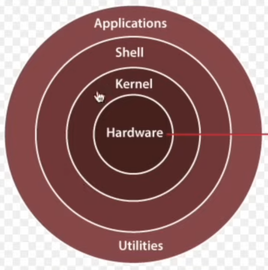

## History
- UNIX and Linux both are OS
- UNIX is paid, while Linux is free open source
- UNIX is mainly for specialised hardware and enterprises
- UNIX is owned by companies, IBM, Oracle
- MacOS is a version of UNIX
- Linux is just a Kernel, not a complete OS
- Linux is inspired from UNIX

## How to run Linux
1. WSL (Windows subsystem for Linux)
- Windows have Linux
2. VirtualBox
3. Cloud VM (AWS/ Azure/ GCP)
4. Containers

## Linux Kernel
- Linux is a kernel responsible for execution task written in `C`
- Shell is used to communicate to the Linux Kernel using `shell cmds`
- Linux System Architecture

## What is Bootloader
- A kernel process which runs the files needed to start the OS
- Example: GRuB,