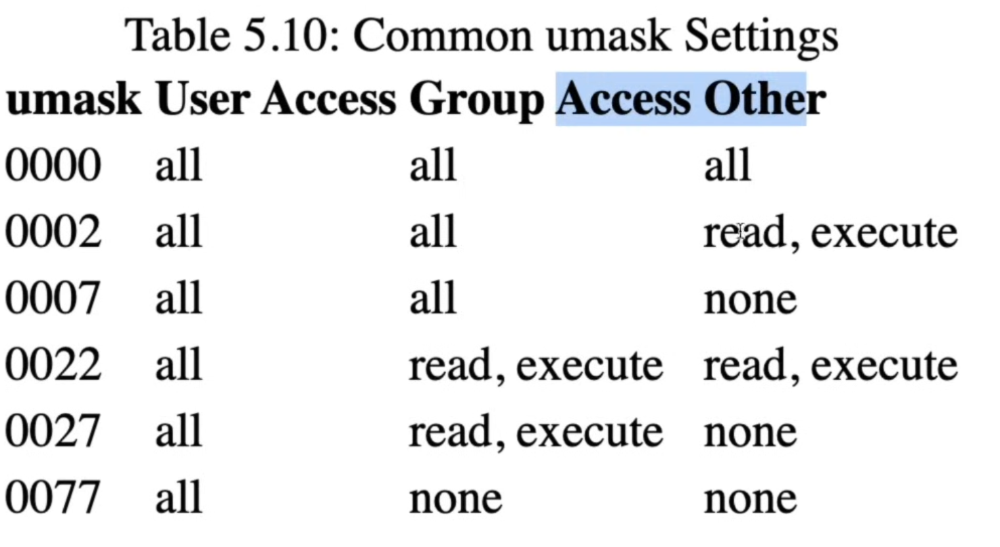

### 1. ls -l
- shows the permissions of file
- `drwxrwxr-x`
- `d` -> directory
- 1st `rwx` -> user
- 2nd `rwx` -> group
- 3rd `r-x` -> other user
- read(r), write(w), executable(x)

### 2. chmod
- change file permission
- `chmod 777 file_name` -> `drwxrwxrwx`

### 3. umash
- shows default perimission for any new file

### 4. chown
- change user ownership of file/directory 
- `sudo chown user_name file_name`

### 5. chgrp
- change grp ownership of file/directory
- `sudo chgrp grp_name file_name`

## Compression 

- `sudo apt install zip`
- gunzip, gzip

### 1. zip
- zip file(s)
- `zip -r zip_file_name.zip directory_to_zip/`

### 2. unzip
- unzip file
- `unzip zip_file_name.zip directory_to_unzip/`

### 3. tar
- `tar -cvzf file_name.tar.gz file_to_compress/`
- `tar -xvzf file_name.tar.gz`

## file transfer between remote and local
### 1. scp
- secure copy
- need a `.pem` file which is the private key of the remote instance
- copy file from local to remote `scp -i path_to_private_key_of_remote_instance -r source_of_file ubuntu@13.206.7.105:/destination_location`
- copy file from remote to local `scp -i "path_to_private_key_of_remote_instance" -r ubuntu@13.206.7.105:/destination_location source_of_file`

### 2. rsync
- sync the file between the local and remote
- sync remote server with files in local -> `rsync -e "ssh -i path_to_private_key_of_remote_instance" -avz path_to_local_file ubuntu@13.206.7.105:/path_on_remote`
- sync local server with files in remote -> `rsync -e "ssh -i path_to_private_key_of_remote_instance" -avz ubuntu@13.206.7.105:/path_on_remote path_to_local_file`
