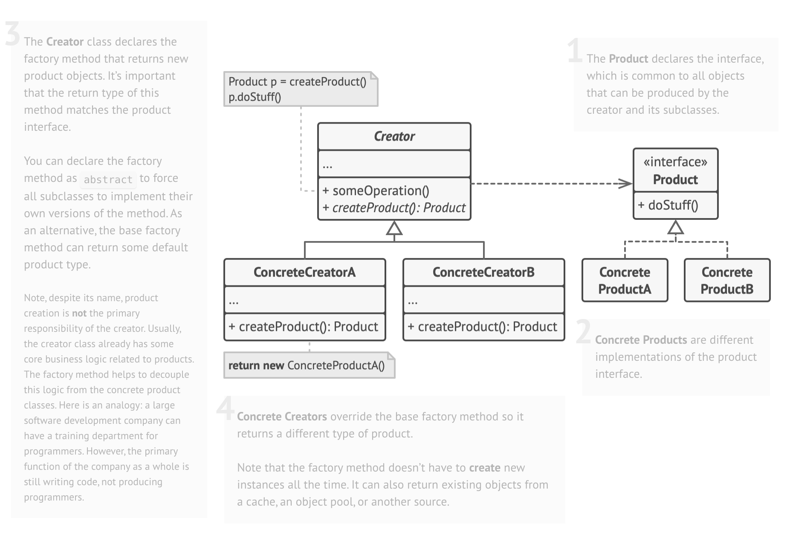

# Factory Design Pattern
- Factory Method lets a class defer object creation to subclasses.

## Use Factory Method when:

- object creation logic varies
- object type is chosen at runtime
- you want to avoid if-else / switch noise
- you want Open-Closed Principle (extend without modifying existing code)
- you want polymorphic creation

## Without Factory Method
```java
class NotificationService {
    public Notification create(String type) {
        if (type.equals("SMS")) return new SMSNotification();
        if (type.equals("EMAIL")) return new EmailNotification();
        return null;
    }
}
```

## Factory Method
1. Product Interface
```java
interface Notification {
    void send(String message);
}
```
2. Concrete Products
```java
class SMSNotification implements Notification {
    public void send(String message) {
        System.out.println("SMS: " + message);
    }
}

class EmailNotification implements Notification {
    public void send(String message) {
        System.out.println("Email: " + message);
    }
}
```
3. Creator (defines factory method)
```java
abstract class NotificationFactory {
    public abstract Notification createNotification();
}
```

4. Concrete Factories (decide WHAT to create)
```java
class SMSFactory extends NotificationFactory {
    public Notification createNotification() {
        return new SMSNotification();
    }
}

class EmailFactory extends NotificationFactory {
    public Notification createNotification() {
        return new EmailNotification();
    }
}
```

5. Client Code (uses abstraction only)
```java
public class Main {
    public static void main(String[] args) {

        NotificationFactory factory = new SMSFactory();
        Notification n1 = factory.createNotification();
        n1.send("Hello!");

        factory = new EmailFactory();
        Notification n2 = factory.createNotification();
        n2.send("Welcome!");
    }
}
```

## What did we gain
### 1. No dependency on concrete classes
- client never calls `new SMSNotification()`
- only calls `factory.createNotification()`
### 2. Extensible
- to add a push notification, add
```java
class PushNotification implements Notification {...}
class PushFactory extends NotificationFactory {...}
```
### 3. Aligned with SOLID
- Especially Open-Closed Principle

## Product vs Creator
Factory Method separates 
1. Product -> What gets created
2. Creator -> Who decides which product

This removes hard coupling between them.

## Structure
- 

## When to use Factory Method
### 1. Use Factory Method when you don’t know the exact object type ahead of time

- Sometimes your code works with interfaces or abstract types, but you don’t know which implementation should be used until runtime.
- Use Factory Method when your code must work with objects whose concrete classes are unknown ahead of time and may change dynamically.
```java
Notification n = factory.createNotification();
```
- The client only knows: Notification
- But the factory may decide:
    - EmailNotification
    - SMSNotification
    - PushNotification
    - SlackNotification
    - etc.
#### Why is this useful?
1. i avoid if–else mess
2. i avoid modifying client code when adding new types
3. creation logic stays isolated

#### Product creation code is separated from product usage code.

So to add a new product type, you:
1. create a new subclass factory
2. override the factory method

## 2. Use Factory Method to let users extend a framework or library
- Factory Method gives framework users a legal extension point
- Frameworks use Factory Method to let users replace internal components by subclassing and overriding creation behavior.
For frameworks
1. define base classes
2. define factory methods
3. users override them to modify or extend

## 3. Use Factory Method to reuse expensive objects (object pooling)
### Problem: Some objects should not be created constantly:
- DB connections
- Sockets
- Threads
- Buffers
- File handles

Creation cost = HIGH & Resource availability = LIMITED

So we want:
1. reuse existing ones
2. create new ones only when necessary
3. centralize lifecycle management

### Constructors Cannot Help
Because constructors:
1. must always return new objects
2. cannot return pooled instances
So we need a regular method to control creation.

#### Instead of this
```java
DBConnection conn = new DBConnection();
```
#### We do
```java
DBConnection conn = DBConnectionFactory.getConnection();
```
#### Now the factory decides:
- reuse?
- create new?
- return from cache?
- throttle creation?

### Factory Method can 
1. check a pool
2. reuse if possible
3. create if needed
4. track availability
5. return object
```java
class ConnectionFactory {

    private static final List<DBConnection> pool = new ArrayList<>();

    public static DBConnection getConnection() {

        if (!pool.isEmpty()) {
            return pool.remove(0); // reuse
        }

        return new DBConnection(); // create new
    }

    public static void release(DBConnection conn) {
        pool.add(conn);
    }
}
```
Client
```java
DBConnection c1 = ConnectionFactory.getConnection();
ConnectionFactory.release(c1);
DBConnection c2 = ConnectionFactory.getConnection();
```