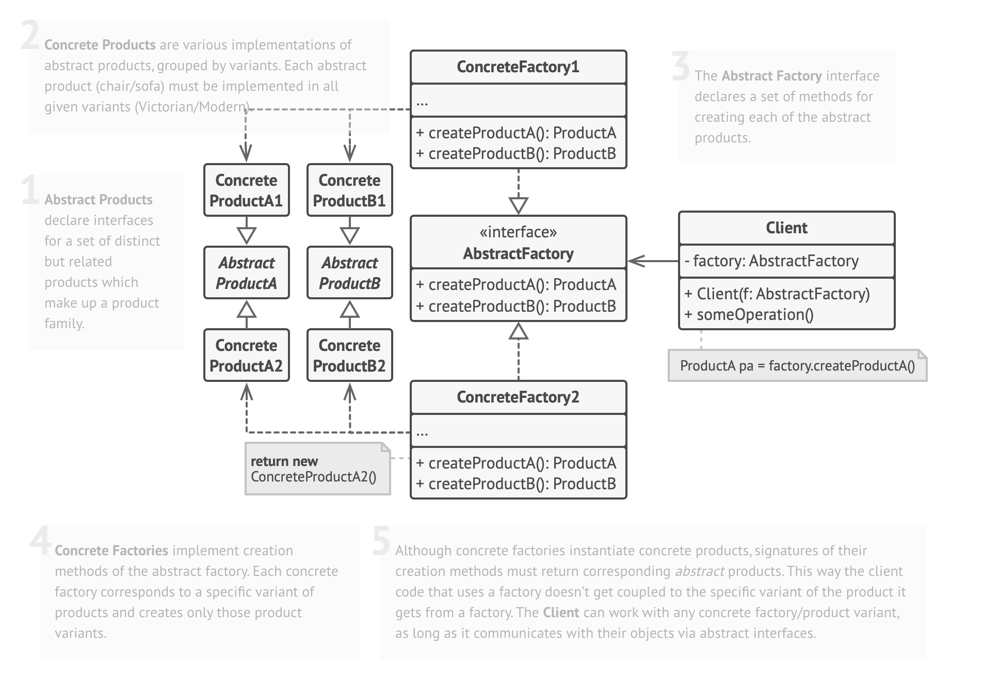

# Abstract Factory Method
- Provides an interface for creating families of related objects — without specifying their concrete classes.
- So instead of creating one kind of product (Factory Method),
you create multiple coordinated products together.

## When Do We Use It?

- Your system needs consistent product families
(e.g., Windows UI vs Mac UI)

- You want to switch entire product families at runtime

- You want to avoid mixing incompatible objects
(e.g., WindowsButton + MacCheckbox)

- You want loose coupling —
client shouldn’t depend on new ConcreteClass()

- You want Open-Closed Principle (extend without modifying)

## How to Implement
1. Map out a matrix of distinct product types versus variants of these products.

2. Declare abstract product interfaces for all product types. Then make all concrete product classes implement these interfaces.

3. Declare the abstract factory interface with a set of creation methods for all abstract products.

4. Implement a set of concrete factory classes, one for each product variant.

5. Create factory initialization code somewhere in the app. It should instantiate one of the concrete factory classes, depending on the application configuration or the current environment. Pass this factory object to all classes that construct products.

6. Scan through the code and find all direct calls to product constructors. Replace them with calls to the appropriate creation method on the factory object.

## Example — UI Toolkit

We’ll design:
- Products:
    - Button
    - Checkbox
- Factories:
    - WindowsUIFactory
    - MacUIFactory
- Client:
    - Application

### 1. Product Interface
```java
interface Button {
    void render();
}

interface Checkbox {
    void check();
}
```

### 2. Concrete Products 
1. Windows
```java
class WindowsButton implements Button {
    public void render() {
        System.out.println("Windows Button Rendered");
    }
}

class WindowsCheckbox implements Checkbox {
    public void check() {
        System.out.println("Windows Checkbox Checked");
    }
}
```
2. Mac
```java
class MacButton implements Button {
    public void render() {
        System.out.println("Mac Button Rendered");
    }
}

class MacCheckbox implements Checkbox {
    public void check() {
        System.out.println("Mac Checkbox Checked");
    }
}
```
### 3. Abstract Factory Interface
```java
interface UIFactory {
    Button createButton();
    Checkbox createCheckbox();
}
```
### 4. Concrete Factories
1. Windows Factory
```java
class WindowsFactory implements UIFactory{
    public Button createButton(){
        return new WindowsButton();
    }
    public Checkbox createCheckbox(){
        return new WindowsCheckbox();
    }
}
```
2. Mac Factory
```java
class MacFactory implements UIFactory{
    public Button createButton(){
        return new MacButton();
    }
    public Checkbox createCheckbox(){
        return new MacCheckbox;
    }
}
```
### 5. Client Code
```java
class Application{
    private Button button;
    private Checkbox checkbox;

    public Application(UIFactory factory){
        this.button = factory.createButton();
        this.checkbox = factory.createCheckbox();
    }
    public void render(){
        button.render();
        checkbox.render();
    }
}
```

### 6. Runtime Factory Selection
```java
public class Main{
    public static void main(String[] args){
        UIFactory factory;
        String os = "MAC";

        if(os.equals("MAC")){
            factory = new MacFactory();
        }
        else factory = new WindowsFactory();
        
        Application app = new Application(factory);
        app.render();
    }
}
```

## Benefits
#### 1. Strong encapsulation
- Clients don’t know implementation details.

#### 2. System-wide consistency
- No mismatch like MacCheckbox + WindowsButton.

#### 3. Open-Closed Principle
- Add new family? Create new factory.

#### 4. Dependency Inversion Principle
- Clients depend on abstractions.

## Tradeoffs
#### 1. More Classes 
- Each family needs its own factory

#### 2. Harder to add new product types
- All factories must change

#### 3. Possible over-engineering
- For simple systems

## When to Use
1. The code needs to work with various families of related products, but you don’t want it to depend on the concrete classes of those products

2. It prevents mixing incompatible product variants and centralizes creation logic while keeping code loosely coupled.

## Strcuture
- 