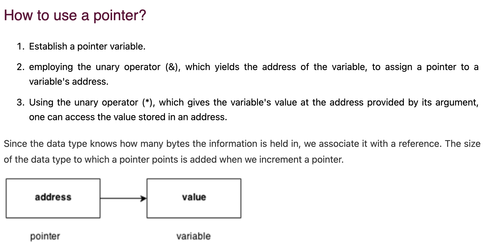
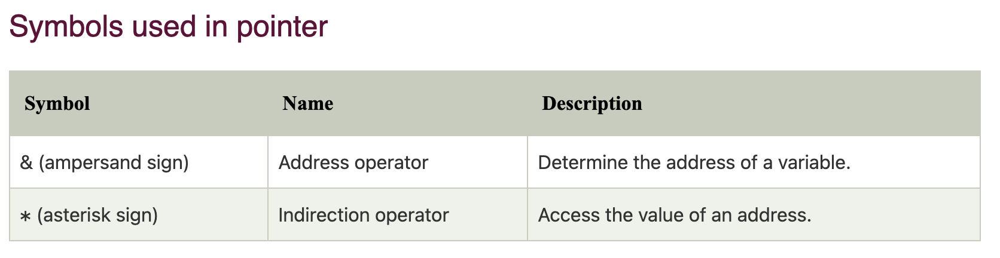
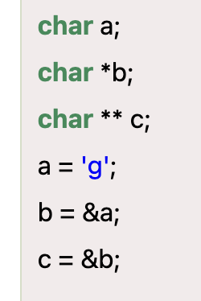
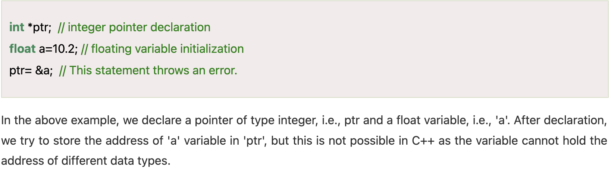
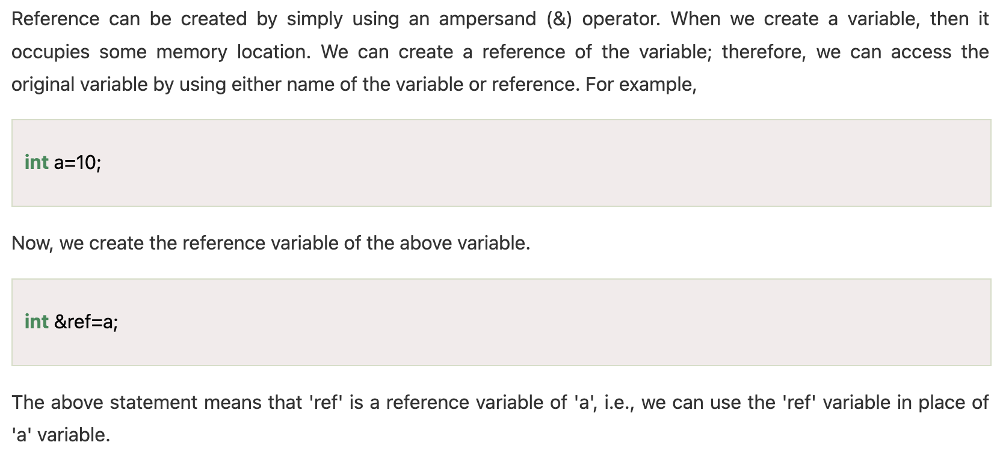
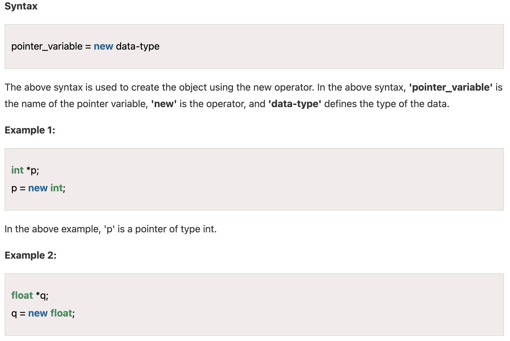
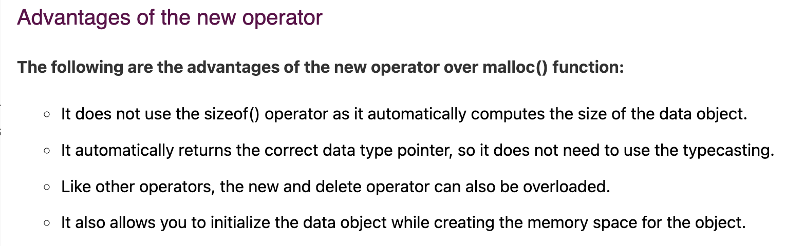

### I/O Library Header Files
- The cout object is an ostream class predefined object.
- The cin is a predefined object of istream class.
- The endl is a predefined object of ostream class. It is used to insert a new line characters and flushes the stream.
- cerr stands for "standard error". It is an unbuffered stream, meaning that output sent to cerr is immediately displayed on the console without buffering.
- clog stands for "standard log". It is a buffered stream, similar to cout. It's often used for writing informational or diagnostic messages that are less time-sensitive than errors. The use of buffering can improve performance when displaying a large number of messages.

## Data Types


## References and Pointers
- A variable that stores the memory address of another variable is known as a pointer. It permits the allocation and modification of dynamic memory.
- On the other hand, references offer another method of accessing a variable by establishing an alias. 
- Pointers and references are essential for complicated data structures and more sophisticated memory management.
-  A reference is a variable which is another name of the existing variable, while the pointer is variable that stores the address of another variable.

## Data Type Modifiers
- C++ supports the usage of data type modifiers like const, volatile, and mutable to modify the behavior of variables.
- For example, volatile denotes that a variable can be altered outside, but const makes a variable immutable.

## Pointers
- The pointer in C++ language is a variable, it is also known as locator or indicator that points to an address of a value.
- 
- 
- 

## sizeOf()
- The size, which is calculated by the sizeof() operator, is the amount of RAM occupied in the computer.

- If an object contains
    - int d; => size = 4 bytes
    - int c, d; => size = 8 bytes
    - int c; char d; => size = 8 bytes
- in 3 case, there is a concept of structure padding

- size of *int in 64-bit system is 8 bytes.

- array name stores the address of the first element

## void Pointer
- In C++, we cannot assign the address of a variable to the variable of a different data type. Consider the following example:
- 

## reference
- It is a variable that behaves as an alias for another variable.

- It cannot be reassigned means that the reference variable cannot be modified.

## Dynamic Memory Allocation (new)
- 
```cpp
int *a1 = new int[8];  //dynamically create array
//delete dynamically created array
// delete [size] pointer_variable;   
delete [8] a1;

```
```cpp
int main()  {  
    
    int size;  // variable declaration  
    int *arr = new int[size];   // creating an array   
    cout<<"Enter the size of the array : ";     
    std::cin >> size;    //   
    cout<<"\nEnter the element : ";  
    for(int i=0;i<size;i++)   // for loop  
    {  
        cin>>arr[i];  
    }  
    cout<<"\nThe elements that you have entered are :";  
    for(int i=0;i<size;i++)    // for loop  
    {  
        cout<<arr[i]<<",";  
    }  
    delete arr;  // deleting an existing array.  
    return 0;  
}  
```
- 

##### difference between malloc and new
- The main difference between the malloc() and new is that the new is an operator while malloc() is a standard library function that is predefined in a stdlib header file.
