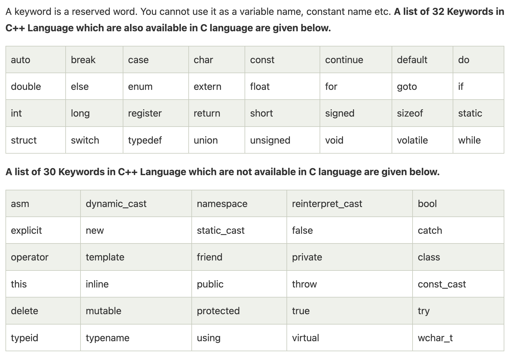

## Difference Between C and C++


## Keywords
- 
- union: It is used to define a union, which resembles a struct but has one shared memory location for all its members.
- Volatile: This keyword instructs the compiler that a variable's value may change at any point, even if it is not immediately apparent from the logic of the program.
- register: The compiler is advised to put the variable in a register for quicker access.
- static: The static keyword is used to declare static variables, which keep their values across function calls.
- Mutable: In C++, the mutable keyword is used to denote the ability to change a member of a const object. It is frequently employed when member variables within const member functions need to be updated.

## Identifiers
- C++ identifiers in a program are used to refer to the name of the variables, functions, arrays, or other user-defined data types created by the programmer. 
- They are the basic requirement of any language. Every language has its own rules for naming the identifiers.

## Dangling Pointers
- A dangling pointer is a pointer that points to invalid data or to data which is not valid anymore
```cpp
Class *object = new Class();
Class *object2 = object;

delete object;
object = nullptr;
// now object2 points to something which is not valid anymore
```

