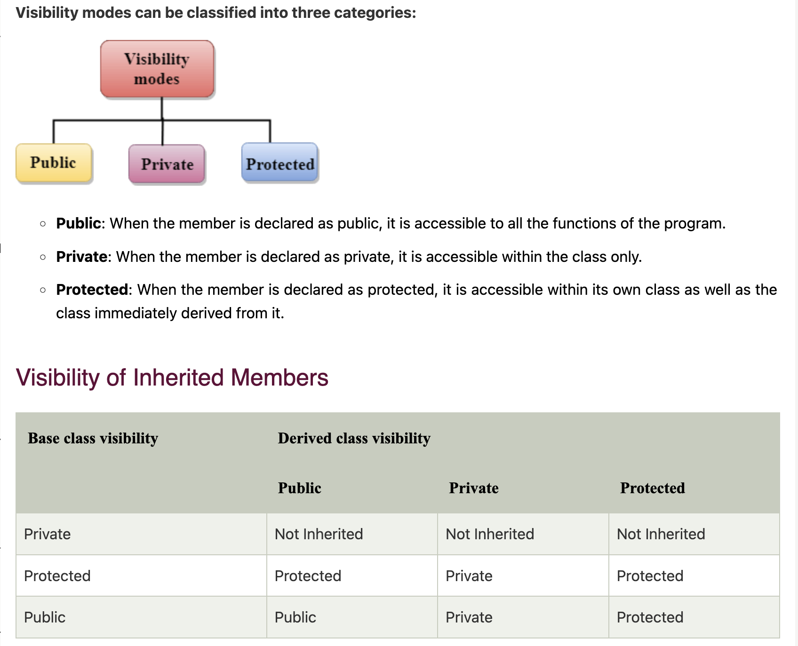

### Types of Inheritance in C++

1. **Single Inheritance**: A derived class inherits from one base class.
   ```cpp
   class Base {
       // Base class members
   };

   class Derived : public Base {
       // Derived class members
   };
   ```

2. **Multiple Inheritance**: A derived class inherits from more than one base class.
   ```cpp
   class Base1 {
       // Base class members
   };

   class Base2 {
       // Base class members
   };

   class Derived : public Base1, public Base2 {
       // Derived class members
   };
   ```

3. **Multilevel Inheritance**: A derived class inherits from a base class, which in turn inherits from another base class.
   ```cpp
   class Base {
       // Base class members
   };

   class Intermediate : public Base {
       // Intermediate class members
   };

   class Derived : public Intermediate {
       // Derived class members
   };
   ```

4. **Hierarchical Inheritance**: Multiple derived classes inherit from a single base class.
   ```cpp
   class Base {
       // Base class members
   };

   class Derived1 : public Base {
       // Derived1 class members
   };

   class Derived2 : public Base {
       // Derived2 class members
   };
   ```

5. **Hybrid Inheritance**: A combination of two or more types of inheritance.
   ```cpp
   class Base {
       // Base class members
   };

   class Intermediate1 : public Base {
       // Intermediate1 class members
   };

   class Intermediate2 : public Base {
       // Intermediate2 class members
   };

   class Derived : public Intermediate1, public Intermediate2 {
       // Derived class members
   };
   ```

### Access Modifiers in C++

Access modifiers control the visibility and accessibility of class members (variables and functions). The three main access modifiers are:

1. **public**: Members declared as public are accessible from outside the class.
2. **protected**: Members declared as protected are accessible within the class and by derived classes.
3. **private**: Members declared as private are accessible only within the class.

#### Example with Access Modifiers

```cpp
#include <iostream>

class Base {
public:
    int publicVar;
    
protected:
    int protectedVar;
    
private:
    int privateVar;

public:
    Base() : publicVar(1), protectedVar(2), privateVar(3) {}

    void displayBase() {
        std::cout << "Base publicVar: " << publicVar << std::endl;
        std::cout << "Base protectedVar: " << protectedVar << std::endl;
        std::cout << "Base privateVar: " << privateVar << std::endl;
    }
};

class Derived : public Base {
public:
    void displayDerived() {
        std::cout << "Derived publicVar: " << publicVar << std::endl;
        std::cout << "Derived protectedVar: " << protectedVar << std::endl;
        // std::cout << "Derived privateVar: " << privateVar << std::endl; // Error: privateVar is not accessible
    }
};

int main() {
    Base base;
    base.displayBase();

    Derived derived;
    derived.displayDerived();

    // Accessing members directly
    std::cout << "Accessing publicVar: " << derived.publicVar << std::endl;
    // std::cout << "Accessing protectedVar: " << derived.protectedVar << std::endl; // Error: protectedVar is not accessible
    // std::cout << "Accessing privateVar: " << derived.privateVar << std::endl; // Error: privateVar is not accessible

    return 0;
}
```

### Explanation

- **Base Class**: Contains members with different access modifiers.
- **Derived Class**: Inherits from `Base` and can access `public` and `protected` members, but not `private` members.
- **Main Function**: Demonstrates accessing members of `Base` and `Derived` classes.

#### Output

```
Base publicVar: 1
Base protectedVar: 2
Base privateVar: 3
Derived publicVar: 1
Derived protectedVar: 2
Accessing publicVar: 1
```

