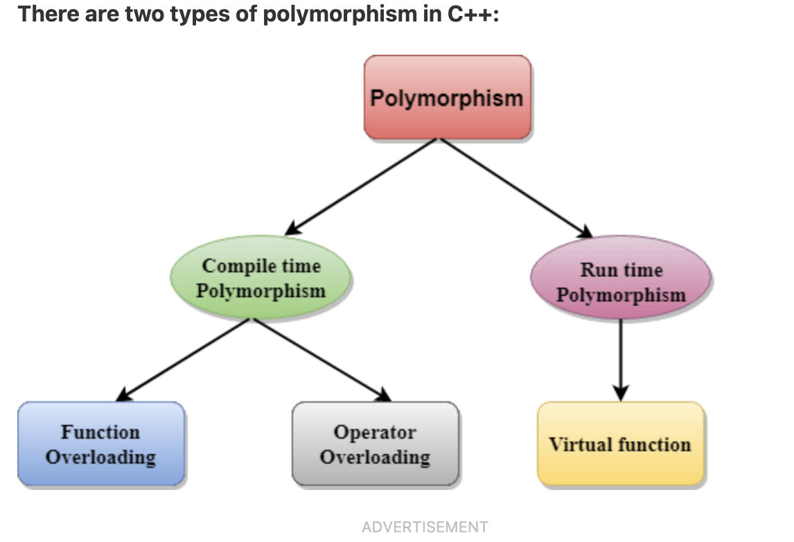
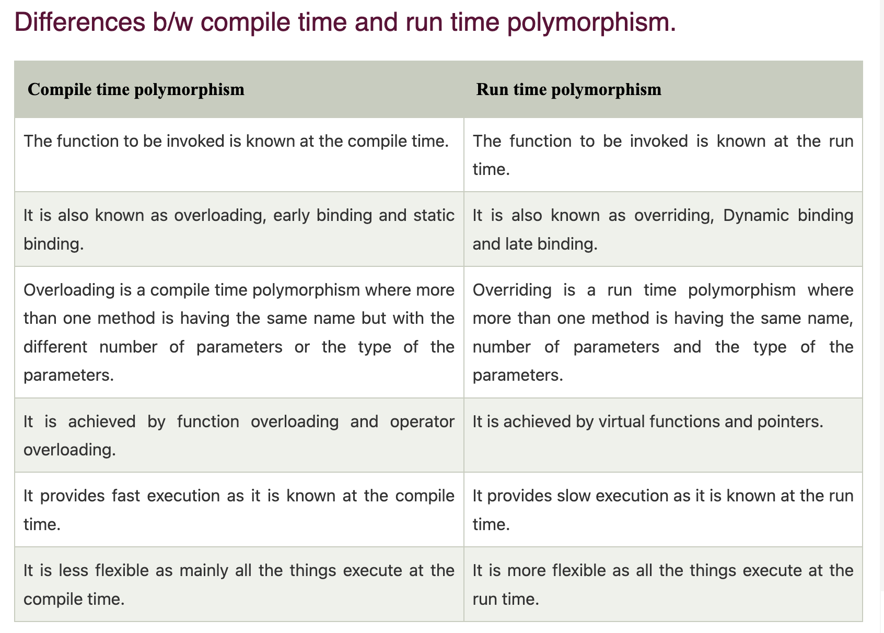

## C++ Polymorphism
- The term "Polymorphism" is the combination of "poly" + "morphs" which means many forms. It is a greek word. In object-oriented programming, we use 3 main concepts: inheritance, encapsulation, and polymorphism.

## Real Life Example Of Polymorphism
- Let's consider a real-life example of polymorphism. A lady behaves like a teacher in a classroom, mother or daughter in a home and customer in a market. Here, a single person is behaving differently according to the situations.



- run time polymorphism only occurs during inheritance when
    1. base class and derived class both have function with same name and same number and type of parameters

## Difference Between Compile Time and Run time Polymorphism



# OVERALL SUMMARY
Polymorphism is a core concept in object-oriented programming (OOP) that allows objects of different classes to be treated as objects of a common base class. It enables a single interface to represent different underlying data types and operations. Polymorphism is of two types:

1. **Compile-time Polymorphism** (Static binding/early binding)
2. **Run-time Polymorphism** (Dynamic binding/late binding)

### 1. Compile-time Polymorphism

Compile-time polymorphism is achieved through function overloading and operator overloading.

#### Function Overloading

Function overloading allows multiple functions to have the same name with different parameters. The correct function to call is determined at compile-time.

##### Real-life Example: Volume Calculation

Consider calculating the volume of different shapes (cube, sphere, and cylinder). We can overload the function `volume` to handle different shapes.

```cpp
#include <iostream>
#include <cmath>

class VolumeCalculator {
public:
    // Volume of a cube
    double volume(double side) {
        return side * side * side;
    }

    // Volume of a sphere
    double volume(double radius, bool isSphere) {
        return (4.0/3) * M_PI * radius * radius * radius;
    }

    // Volume of a cylinder
    double volume(double radius, double height) {
        return M_PI * radius * radius * height;
    }
};

int main() {
    VolumeCalculator calc;
    std::cout << "Volume of cube: " << calc.volume(3.0) << std::endl;
    std::cout << "Volume of sphere: " << calc.volume(3.0, true) << std::endl;
    std::cout << "Volume of cylinder: " << calc.volume(3.0, 5.0) << std::endl;
    return 0;
}
```

#### Operator Overloading

Operator overloading allows us to define the behavior of operators for user-defined types (like classes).

##### Real-life Example: Complex Number Addition

Consider adding two complex numbers.

```cpp
#include <iostream>

class Complex {
private:
    double real, imag;

public:
    Complex(double r = 0.0, double i = 0.0) : real(r), imag(i) {}

    // Overload + operator to add two Complex objects
    Complex operator + (const Complex& other) {
        return Complex(real + other.real, imag + other.imag);
    }

    void display() {
        std::cout << real << " + " << imag << "i" << std::endl;
    }
};

int main() {
    Complex c1(3.0, 4.0), c2(1.0, 2.0);
    Complex c3 = c1 + c2;  // Using overloaded + operator
    c3.display();
    return 0;
}
```

### 2. Run-time Polymorphism

Run-time polymorphism is achieved through inheritance and virtual functions. It allows the method to be resolved at run time, meaning the method that is executed is determined by the type of object being referred to.

#### Virtual Functions

A virtual function is a function in a base class that is overridden in a derived class. The function call is resolved at runtime.

##### Real-life Example: Payment System

Consider a payment system where we have different payment methods: CreditCard and PayPal.

```cpp
#include <iostream>

// Base class
class Payment {
public:
    virtual void pay(double amount) {
        std::cout << "Paying $" << amount << std::endl;
    }
};

// Derived class: CreditCard
class CreditCard : public Payment {
public:
    void pay(double amount) override {
        std::cout << "Paying $" << amount << " using Credit Card." << std::endl;
    }
};

// Derived class: PayPal
class PayPal : public Payment {
public:
    void pay(double amount) override {
        std::cout << "Paying $" << amount << " using PayPal." << std::endl;
    }
};

int main() {
    Payment* payment;

    CreditCard cc;
    PayPal pp;

    // Paying with Credit Card
    payment = &cc;
    payment->pay(100.0);

    // Paying with PayPal
    payment = &pp;
    payment->pay(200.0);

    return 0;
}
```

In this example, the `pay` method is called on a `Payment` pointer, but the actual method that gets executed is determined at runtime based on the object being pointed to (`CreditCard` or `PayPal`).

### Summary

- **Compile-time Polymorphism**:
  - Achieved via function overloading and operator overloading.
  - Resolved during compilation.
  - Example: Different implementations of `volume` for different shapes.

- **Run-time Polymorphism**:
  - Achieved via inheritance and virtual functions.
  - Resolved during runtime.
  - Example: Different payment methods like `CreditCard` and `PayPal`.

Polymorphism allows for flexible and reusable code, making it easier to manage and extend. It enables a single interface to represent different underlying forms (data types), thus facilitating the implementation of dynamic and adaptable software systems.


### Operator that cannot be overloaded are as follows:

Scope operator (::)
Sizeof
member selector(.)
member pointer selector(*)
ternary operator(?:)