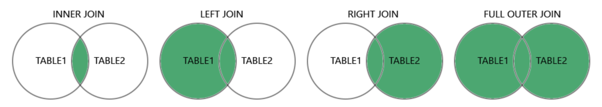

## 1. SQL JOIN
A JOIN clause is used to combine rows from two or more tables, based on a related column between them.

### Different Types of SQL JOINs


1. (INNER) JOIN: Returns records that have matching values in both tables
2. LEFT (OUTER) JOIN: Returns all records from the left table, and the matched records from the right table
3. RIGHT (OUTER) JOIN: Returns all records from the right table, and the matched records from the left table
4. FULL (OUTER) JOIN: Returns all records when there is a match in either left or right table
- 

## 2. INNER JOIN
The `INNER JOIN` keyword selects records that have matching values in both tables.

### Syntax
```sql
SELECT column_name(s)
FROM table1
INNER JOIN table2
ON table1.column_name = table2.column_name;
```

### Example: Join Products and Categories with the INNER JOIN keyword:
```sql
SELECT ProductID, ProductName, CategoryName
FROM Products
INNER JOIN Categories ON Products.CategoryID = Categories.CategoryID;
```

### Note: It is a good practice to include the table name when specifying columns in the SQL statement.
```sql
SELECT Products.ProductID, Products.ProductName, Categories.CategoryName
FROM Products
INNER JOIN Categories ON Products.CategoryID = Categories.CategoryID;
```

### JOIN Three Tables
selects all orders with customer and shipper information:
```sql
SELECT Orders.OrderID, Customers.CustomerName, Shippers.ShipperName
FROM ((Orders
INNER JOIN Customers ON Orders.CustomerID = Customers.CustomerID)
INNER JOIN Shippers ON Orders.ShipperID = Shippers.ShipperID);
```

## 2. LEFT JOIN
The `LEFT JOIN` keyword returns all records from the left table, and the matching records from the right table . 

#### Note: The LEFT JOIN keyword returns all records from the left table (Customers), even if there are no matches in the right table (Orders).

### Example: Select all customers, and any orders they might have:

```sql
SELECT Customers.CustomerName, Orders.OrderID
FROM Customers
LEFT JOIN Orders ON Customers.CustomerID = Orders.CustomerID
ORDER BY Customers.CustomerName;
```

## 3. RIGHT JOIN Keyword
The `RIGHT JOIN` keyword returns all records from the right table, and the matching records from the left table 

### Example: Return all employees, and any orders they might have placed:
```sql
SELECT Orders.OrderID, Employees.LastName, Employees.FirstName
FROM Orders
RIGHT JOIN Employees ON Orders.EmployeeID = Employees.EmployeeID
ORDER BY Orders.OrderID;
```

## 4. FULL JOIN Keyword
The `FULL JOIN` keyword returns all records when there is a match in left or right table records.

### Example: selects all customers, and all orders:
```sql
SELECT Customers.CustomerName, Orders.OrderID
FROM Customers
FULL OUTER JOIN Orders ON Customers.CustomerID=Orders.CustomerID
ORDER BY Customers.CustomerName;
```

## 5. Self Join
A self join is a regular join, but the table is joined with itself.

### Syntax
```sql
SELECT column_name(s)
FROM table1 T1, table1 T2
WHERE condition;
```

### Example: customers that are from the same city:

```sql
SELECT A.CustomerName AS CustomerName1, B.CustomerName AS CustomerName2, A.City
FROM Customers A, Customers B
WHERE A.CustomerID <> B.CustomerID
AND A.City = B.City
ORDER BY A.City;
```

## 6. UNION Operator
The `UNION` operator is used to combine the result-set of two or more `SELECT` statements.

The `UNION` operator automatically removes duplicate rows from the result set.

Requirements for UNION:

1. Every `SELECT` statement within `UNION` must have the same number of columns
2. The columns must also have similar data types
3. The columns in every `SELECT` statement must also be in the same order

#### Note: The column names in the result-set are usually equal to the column names in the first SELECT statement.

### Syntax
```sql
SELECT column_name(s) FROM table1
UNION
SELECT column_name(s) FROM table2;
```

### Example:  returns the German cities (only distinct values) from both the "Customers" and the "Suppliers" table:

```sql
SELECT City, Country FROM Customers
WHERE Country='Germany'
UNION
SELECT City, Country FROM Suppliers
WHERE Country='Germany'
ORDER BY City;
```

### Example:  lists all customers and suppliers:

```sql
SELECT 'Customer' AS Type, ContactName, City, Country
FROM Customers
UNION
SELECT 'Supplier', ContactName, City, Country
FROM Suppliers;
```

## 7. UNION ALL Operator
The `UNION ALL` operator is used to combine the result-set of two or more SELECT statements.

The `UNION ALL` operator includes all rows from each statement, including any duplicates.

Requirements for `UNION ALL`: 
Every SELECT statement within `UNION ALL` must have
1. The same number of columns
2. The columns with similar data types
3. The columns in the same order

#### While the UNION operator removes duplicate values by default, the UNION ALL includes duplicate values:

### returns the cities (duplicate values also) from both the "Customers" and the "Suppliers" table:
```sql
SELECT City FROM Customers
UNION ALL
SELECT City FROM Suppliers
ORDER BY City;
```

## 8.  EXISTS Operator
The `EXISTS` operator is used to test for the existence of any record in a subquery.

The `EXISTS` operator returns TRUE if the subquery returns one or more records.

### EXISTS Syntax
```sql
SELECT column_name(s)
FROM table_name
WHERE EXISTS
(SELECT column_name FROM table_name WHERE condition);
```

### Example:  lists the suppliers with a product price less than 20:

```sql
SELECT SupplierName
FROM Suppliers
WHERE EXISTS (SELECT ProductName FROM Products WHERE Products.SupplierID = Suppliers.supplierID AND Price < 20);
```

## 9. ANY Operator

Returns a boolean value as a result

Returns TRUE if ANY of the subquery values meet the condition

ANY means that the condition will be true if the operation is true for any of the values in the range.

#### Note: The operator must be a standard comparison operator (=, <>, !=, >, >=, <, or <=).

### ANY Syntax
```sql
SELECT column_name(s)
FROM table_name
WHERE column_name operator ANY
  (SELECT column_name
  FROM table_name
  WHERE condition);
```

### Example: Lists the ProductName if it finds ANY records in the OrderDetails table has Quantity equal to 10
```sql
SELECT ProductName
FROM Products
WHERE ProductID = ANY
  (SELECT ProductID
  FROM OrderDetails
  WHERE Quantity = 10);
```

## 10. ALL Operator

Returns a boolean value as a result

Returns TRUE if ALL of the subquery values meet the condition

Is used with `SELECT`, `WHERE` and `HAVING` statements

ALL means that the condition will be true only if the operation is true for all values in the range. 

### ALL Syntax With SELECT
```sql
SELECT ALL column_name(s)
FROM table_name
WHERE condition;
```

### ALL Syntax With WHERE or HAVING
```sql
SELECT column_name(s)
FROM table_name
WHERE column_name operator ALL
  (SELECT column_name
  FROM table_name
  WHERE condition);
```

### Example: Lists the ProductName if ALL the records in the OrderDetails table has Quantity equal to 10.
```sql
SELECT ProductName
FROM Products
WHERE ProductID = ALL
  (SELECT ProductID
  FROM OrderDetails
  WHERE Quantity = 10);
```

## 11 CASE Expression
The CASE expression goes through conditions and returns a value when the first condition is met (like an if-then-else statement). 

So, once a condition is true, it will stop reading and return the result. If no conditions are true, it returns the value in the ELSE clause.

If there is no ELSE part and no conditions are true, it returns NULL.

### CASE Syntax
```sql
CASE
    WHEN condition1 THEN result1
    WHEN condition2 THEN result2
    WHEN conditionN THEN resultN
    ELSE result
END;
```

### Example:
```sql
SELECT OrderID, Quantity,
CASE
    WHEN Quantity > 30 THEN 'The quantity is greater than 30'
    WHEN Quantity = 30 THEN 'The quantity is 30'
    ELSE 'The quantity is under 30'
END AS QuantityText
FROM OrderDetails;
```

### Example
```sql
SELECT CustomerName, City, Country
FROM Customers
ORDER BY
(CASE
    WHEN City IS NULL THEN Country
    ELSE City
END);
```

## 12. NULL Functions
SQL IFNULL() and COALESCE() Functions

The MySQL IFNULL() function lets you return an alternative value if an expression is NULL:

```sql
SELECT ProductName, UnitPrice * (UnitsInStock + IFNULL(UnitsOnOrder, 0))
FROM Products;
```

Or we can use the COALESCE() function, like this:
```sql
SELECT ProductName, UnitPrice * (UnitsInStock + COALESCE(UnitsOnOrder, 0))
FROM Products;
```

## 13. Views
In SQL, a view is a virtual table based on the result-set of an SQL statement.

A view contains rows and columns, just like a real table. The fields in a view are fields from one or more real tables in the database.

### Creating a View -> CREATE VIEW Statement

We can add SQL statements and functions to a view and present the data as if the data were coming from one single table.

#### CREATE VIEW Syntax
```sql
CREATE VIEW view_name AS
SELECT column1, column2, ...
FROM table_name
WHERE condition;
```

#### Note: A view always shows up-to-date data! The database engine recreates the view, every time a user queries it.

#### Example: 
```sql
CREATE VIEW [Brazil Customers] AS
SELECT CustomerName, ContactName
FROM Customers
WHERE Country = 'Brazil';
```

We can query the view above as follows:
```sql
SELECT * FROM [Brazil Customers];
```

### Updating a View -> CREATE OR REPLACE Statement
A view can be updated with the CREATE OR REPLACE VIEW statement.

#### SQL CREATE OR REPLACE VIEW Syntax
```sql
CREATE OR REPLACE VIEW view_name AS
SELECT column1, column2, ...
FROM table_name
WHERE condition;
```

#### Example: The following SQL adds the "City" column to the "Brazil Customers" view:

```sql
CREATE OR REPLACE VIEW [Brazil Customers] AS
SELECT CustomerName, ContactName, City
FROM Customers
WHERE Country = 'Brazil';
```

### Dropping a View -> DROP VIEW

#### SQL DROP VIEW Syntax
```sql
DROP VIEW view_name;
```

#### Example: The following SQL drops the "Brazil Customers" view:
```sql
DROP VIEW [Brazil Customers];
```